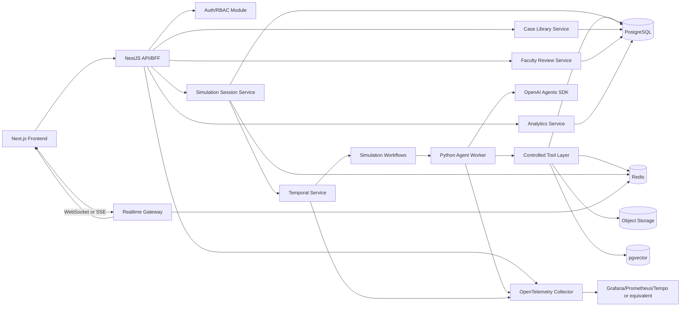
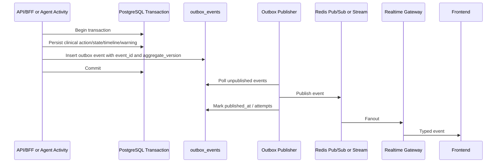

# ClinMira AI Backend and Database Architecture

## 1. Backend Goal

The ClinMira backend is not a normal CRUD API. It is the simulation control plane for a real-time, faculty-reviewable, safety-aware, multi-agent Virtual Clinic Simulation OS.

The backend must support:

- Real-time simulation sessions.
- Agent orchestration with OpenAI Agents SDK.
- Stateful synthetic Patient Twins.
- Deterministic clinical facts and hidden/revealed fact management.
- Safety checks before and after risky actions.
- Faculty review and scenario approval.
- Rubric-grounded evaluation and debriefing.
- Scenario Studio authoring and publishing.
- Analytics for students, cohorts, faculty, and institutions.
- Durable workflows for simulation actions, debrief generation, scenario publish, and review tasks.
- Realtime event delivery through WebSocket or SSE.
- Object storage for synthetic educational imaging/audio.
- Observability, tracing, audit logs, and replay.

Core backend invariant:

- PostgreSQL is the source of truth.
- Redis is cache, presence, rate limiting, and realtime coordination.
- Temporal is durable workflow orchestration.
- Python agent workers own OpenAI Agents SDK integration.
- API/BFF owns SaaS API shape, auth, RBAC, validation, and frontend contracts.
- LLM outputs never become clinical truth without source mapping and validation.

### Source Basis

- [Temporal Workflows](https://docs.temporal.io/workflows) describe durable workflow execution and replay.
- [Temporal Activities](https://docs.temporal.io/activities) describe external work such as LLM calls, API calls, database queries, and file I/O as Activities.
- [PostgreSQL transactions](https://www.postgresql.org/docs/current/tutorial-transactions.html) define all-or-nothing transactional guarantees.
- [Redis Pub/Sub](https://redis.io/docs/latest/develop/pubsub/) and [Redis Streams](https://redis.io/docs/latest/develop/data-types/streams/) support realtime coordination patterns with different delivery guarantees.
- [Next.js Route Handlers](https://nextjs.org/docs/app/getting-started/route-handlers) and App Router data fetching docs inform frontend integration boundaries.

## 2. Recommended Backend Stack

### Preferred Architecture

- Frontend: `Next.js 16 App Router`
- API/BFF: `NestJS`
- Agent Runtime: `Python + OpenAI Agents SDK`
- Workflow: `Temporal`
- Database: `PostgreSQL`
- ORM for API/BFF: `Prisma` for TypeScript-facing schema and typed queries
- Python persistence: SQLAlchemy or direct repository layer aligned to the same SQL migrations
- Cache/Event: `Redis`
- Object Storage: `S3`, `R2`, or `MinIO`
- Vector Search: `pgvector` initially
- Observability: `OpenTelemetry` plus OpenAI Agents SDK tracing
- Realtime: `WebSocket` primary for bidirectional simulation sessions, with `SSE` acceptable for read-only event streams

### Clear Recommendation

Use `NestJS API/BFF + Python Agent Workers`.

Why NestJS API/BFF:

- Good fit for SaaS APIs, modules, dependency injection, guards, interceptors, validation pipes, OpenAPI, and WebSocket gateways.
- Clean module boundaries for auth, tenants, cases, sessions, faculty review, analytics, and realtime.
- Strong TypeScript alignment with the existing frontend.
- Good BFF layer for translating backend contracts into frontend-friendly DTOs.

Why Python Agent Workers:

- OpenAI Agents SDK Python support is first-class for agent orchestration, tools, guardrails, tracing, sessions, and realtime agents.
- Python is strong for AI workflows, typed Pydantic schemas, async execution, evaluation code, and integrations.
- Keeps LLM/tool runtime separate from public API concerns.

Why Temporal:

- Simulation turns, debriefs, scenario publishing, and faculty review are multi-step processes that need retries, timeouts, failure recovery, and auditability.
- Temporal workflow replay requires deterministic Workflow code, so LLM calls and database writes should be Activities.

Why PostgreSQL:

- Strong relational source of truth for users, institutions, cases, sessions, events, scores, reviews, and audit logs.
- Transactional guarantees for state updates.
- Constraints and indexes enforce data integrity.
- JSONB can hold controlled structured payloads where flexibility is needed.
- pgvector can support early vector search without adding a separate vector database.

Why Redis:

- Low-latency session cache and presence.
- WebSocket fanout coordination.
- Rate limiting.
- Short-lived agent status.
- Pub/Sub for ephemeral realtime fanout and Streams when replay or consumer tracking is needed.

### Alternative: FastAPI-Only Backend for Smaller MVP

FastAPI-only is viable if the team wants one Python backend for API and agent runtime during early MVP.

Benefits:

- Fewer services.
- Direct Python and Agents SDK integration.
- Fast development for AI-heavy prototypes.
- Pydantic-first contracts.

Costs:

- Weaker alignment with TypeScript frontend contracts compared with NestJS plus Prisma.
- More work to structure SaaS modules, RBAC, WebSocket gateways, and OpenAPI governance at scale.
- Risk of mixing public API, workflow, and agent concerns too early.

Recommendation:

- MVP with serious future scale: `NestJS API/BFF + Python Agent Workers`.
- Small spike/proof-of-concept: `FastAPI-only`, then split later if needed.

### Source Basis

- [NestJS Modules](https://docs.nestjs.com/modules) supports feature modules and dependency injection for clean SaaS boundaries.
- [NestJS Controllers](https://docs.nestjs.com/controllers) supports request routing and DTO validation patterns.
- [NestJS Gateways](https://docs.nestjs.com/websockets/gateways) supports WebSocket gateway architecture.
- [FastAPI features](https://fastapi.tiangolo.com/features/) supports Python API alternatives with type hints, async, validation, and OpenAPI.
- [Prisma data model](https://www.prisma.io/docs/orm/prisma-schema/data-model/models) and [Prisma Client CRUD](https://www.prisma.io/docs/orm/prisma-client/queries/crud) support typed TypeScript data access for the API/BFF.

## 3. System Architecture Diagram



## 4. Service Boundaries

Start as a modular monolith plus agent worker service. Design every module as service-ready later.

### 4.1 Auth/RBAC Module

Responsibilities:

- Authenticate users.
- Resolve actor identity, tenant, institution, role, and permissions.
- Enforce role-based access to student, faculty, admin, and agent-control areas.
- Issue or validate session tokens.

Key entities:

- `users`
- `roles`
- `institutions`
- `enrollments`

APIs:

- `POST /auth/login`
- `GET /me`

Events emitted:

- `auth.login.succeeded`
- `auth.login.failed`
- `user.role.changed`

Dependencies:

- PostgreSQL
- Audit logs

### 4.2 Tenant/University Module

Responsibilities:

- Manage institutions, programs, cohorts, settings, and tenant boundaries.
- Scope all records by institution.
- Provide tenant settings for safety strictness, faculty approval requirements, language, and retention.

Key entities:

- `institutions`
- `cohorts`
- `enrollments`
- `users`

APIs:

- `GET /me`
- Future admin APIs for institution settings.

Events emitted:

- `institution.created`
- `cohort.created`
- `enrollment.created`

Dependencies:

- Auth/RBAC
- Audit logs

### 4.3 User/Cohort Module

Responsibilities:

- Manage student/faculty membership.
- Track cohorts, course assignments, and learner progress.
- Support analytics grouping.

Key entities:

- `users`
- `cohorts`
- `enrollments`
- `scores`

APIs:

- `GET /faculty/dashboard`
- Future `GET /cohorts/:id/students`

Events emitted:

- `cohort.assignment.updated`
- `student.progress.updated`

Dependencies:

- Tenant module
- Analytics module

### 4.4 Case Library Module

Responsibilities:

- Store synthetic educational cases.
- Version case definitions.
- Maintain static facts, hidden facts, reveal rules, learning objectives, and approved assets.
- Ensure sessions lock to a specific case version.

Key entities:

- `cases`
- `case_versions`
- `patient_twins`
- `patient_personas`
- `hidden_facts`
- `imaging_results`
- `rubric_templates`

APIs:

- `GET /cases`
- `GET /cases/:id`

Events emitted:

- `case.created`
- `case.version.published`
- `case.asset.approved`

Dependencies:

- Faculty Review
- Object Storage
- Audit logs

### 4.5 Scenario Studio Module

Responsibilities:

- Create and edit scenario drafts.
- Validate required fields.
- Manage scenario versions.
- Submit for faculty approval.
- Publish approved scenarios to Case Library.

Key entities:

- `scenarios`
- `scenario_versions`
- `faculty_reviews`
- `rubric_templates`

APIs:

- `POST /scenarios`
- `GET /scenarios`
- `PATCH /scenarios/:id`
- `POST /scenarios/:id/publish`

Events emitted:

- `scenario.draft.created`
- `scenario.validation.completed`
- `scenario.publish.requested`
- `scenario.published`

Dependencies:

- Faculty Review
- Temporal
- Case Library

### 4.6 Simulation Session Module

Responsibilities:

- Create and manage simulation sessions.
- Lock session to case version.
- Accept student actions.
- Invoke Temporal workflows.
- Persist session state snapshots, messages, actions, orders, timeline, warnings, and scores.

Key entities:

- `simulation_sessions`
- `session_state_snapshots`
- `conversation_messages`
- `clinical_actions`
- `orders`
- `timeline_events`
- `safety_warnings`

APIs:

- `POST /simulation-sessions`
- `GET /simulation-sessions/:id`
- `POST /simulation-sessions/:id/actions`
- `POST /simulation-sessions/:id/orders`
- `POST /simulation-sessions/:id/diagnosis`
- `POST /simulation-sessions/:id/treatment`
- `POST /simulation-sessions/:id/complete`

Events emitted:

- `simulation.session.created`
- `student.action.submitted`
- `patient.message.created`
- `timeline.event.created`
- `session.completed`

Dependencies:

- Temporal
- Agent Runtime
- Redis
- Realtime Module
- Evaluation Module

### 4.7 Agent Event Module

Responsibilities:

- Persist agent runs, tool calls, model runs, guardrail results, and trace metadata.
- Provide Agent Control dashboard data.
- Correlate OpenAI traces, Temporal workflow ids, and application events.

Key entities:

- `agent_events`
- `model_runs`
- `tool_calls`
- `audit_logs`

APIs:

- `GET /agent-runs`
- `GET /agent-runs/:id`
- `GET /agent-events`

Events emitted:

- `agent.run.started`
- `agent.run.completed`
- `agent.tool.called`
- `agent.guardrail.triggered`

Dependencies:

- Agent Runtime
- OpenTelemetry
- Audit logs

### 4.8 Clinical Action Module

Responsibilities:

- Normalize student actions.
- Track action sequence and status.
- Support idempotency.
- Feed evaluator and timeline.

Key entities:

- `clinical_actions`
- `conversation_messages`
- `timeline_events`

APIs:

- `POST /simulation-sessions/:id/actions`
- `POST /simulation-sessions/:id/diagnosis`
- `POST /simulation-sessions/:id/treatment`

Events emitted:

- `student.action.submitted`
- `clinical.action.accepted`
- `clinical.action.blocked`

Dependencies:

- Simulation Session
- Safety
- Evaluation

### 4.9 Orders/Imaging Module

Responsibilities:

- Create clinical orders.
- Enforce imaging justification.
- Return approved synthetic imaging results.
- Track annotations and release state.

Key entities:

- `orders`
- `imaging_results`
- `timeline_events`
- `faculty_reviews`

APIs:

- `POST /simulation-sessions/:id/orders`

Events emitted:

- `order.created`
- `imaging.result.ready`
- `imaging.result.blocked`

Dependencies:

- Object Storage
- Safety
- Faculty Review

### 4.10 Evaluation/Debrief Module

Responsibilities:

- Score actions against rubrics.
- Generate final debriefs.
- Store feedback, reasoning maps, mistake replay, and suggested next cases.

Key entities:

- `rubric_templates`
- `rubric_items`
- `scores`
- `debrief_reports`

APIs:

- `GET /debriefs/:sessionId`
- `POST /debriefs/:sessionId/generate`

Events emitted:

- `score.updated`
- `debrief.generated`
- `debrief.review.requested`

Dependencies:

- Evaluator Agent
- Faculty Review
- Case Library

### 4.11 Faculty Review Module

Responsibilities:

- Manage review queues.
- Approve/reject scenarios, images, unsafe output, and debriefs.
- Record human decisions and comments.

Key entities:

- `faculty_reviews`
- `audit_logs`
- `scenario_versions`
- `imaging_results`
- `debrief_reports`

APIs:

- `GET /faculty/dashboard`
- `GET /faculty/review-queue`
- `POST /faculty/reviews/:id/approve`
- `POST /faculty/reviews/:id/reject`

Events emitted:

- `faculty.review.requested`
- `faculty.review.approved`
- `faculty.review.rejected`

Dependencies:

- Auth/RBAC
- Audit logs
- Scenario Studio
- Imaging
- Evaluation

### 4.12 Analytics Module

Responsibilities:

- Aggregate student, case, rubric, safety, and cohort metrics.
- Provide dashboard and competency trend data.
- Support faculty risk cards and suggested interventions.

Key entities:

- `scores`
- `simulation_sessions`
- `safety_warnings`
- `clinical_actions`
- `debrief_reports`

APIs:

- `GET /faculty/dashboard`
- Future analytics endpoints.

Events emitted:

- `analytics.metric.updated`
- `student.risk.flagged`

Dependencies:

- Evaluation
- Simulation
- Faculty Review

### 4.13 Realtime Module

Responsibilities:

- Manage WebSocket or SSE connections.
- Track presence and session subscriptions.
- Emit typed events.
- Support reconnect with missed-event replay from persisted event log.

Key entities:

- `timeline_events`
- `agent_events`
- `conversation_messages`
- Redis presence keys.

APIs:

- `WS /simulation-sessions/:id/stream`
- Optional `GET /simulation-sessions/:id/events?after=...`

Events emitted:

- `message.delta`
- `message.completed`
- `agent.status.updated`
- `timeline.updated`
- `session.completed`

Dependencies:

- Redis
- Simulation Session
- Auth/RBAC

### 4.14 Audit/Observability Module

Responsibilities:

- Persist audit logs for security and faculty trust.
- Export telemetry.
- Correlate API, Temporal, agent, DB, Redis, and realtime spans.
- Redact sensitive fields where required.

Key entities:

- `audit_logs`
- `agent_events`
- `model_runs`
- `tool_calls`

APIs:

- Future admin/audit endpoints.

Events emitted:

- `audit.event.created`
- `observability.alert.created`

Dependencies:

- OpenTelemetry
- OpenAI Agents SDK tracing
- PostgreSQL

## 5. Database Model

### Database Principles

- Every business table has `id`, `created_at`, `updated_at`, and where relevant `deleted_at`.
- Every tenant-scoped table has `institution_id`.
- Session-level tables include `simulation_session_id`.
- Versioned content uses immutable `case_versions` and `scenario_versions`.
- Clinical truth is relational where stable and JSONB only where schema flexibility is required.
- JSONB fields must still have validation at application level and check constraints where practical.
- Use foreign keys for referential integrity.
- Use indexes for common filters, joins, event replay, review queues, and timeline ordering.
- Use transactions for multi-row state updates.
- Use optimistic concurrency through version numbers on session state.

### Core Tables

| Table | Purpose | Key Columns | Relationships | Indexes and Constraints | JSONB Usage |
| --- | --- | --- | --- | --- | --- |
| `institutions` | Tenant/university root. | `id`, `name`, `slug`, `settings`, `created_at` | Has users, cohorts, cases. | Unique `slug`; not-null `name`. | `settings` for tenant policy flags. |
| `users` | Students, faculty, admins. | `id`, `institution_id`, `email`, `name`, `status`, `profile` | Belongs to institution; has roles/enrollments/sessions. | Unique `(institution_id, email)`; index role/status. | `profile` for preferences and avatar metadata. |
| `roles` | RBAC assignments. | `id`, `user_id`, `institution_id`, `role`, `scope` | Belongs to user/institution. | Unique `(user_id, institution_id, role, scope)`; check role enum. | `scope` if flexible resource scopes are needed. |
| `cohorts` | Course/cohort grouping. | `id`, `institution_id`, `name`, `term`, `program` | Has enrollments. | Index `(institution_id, term)`; unique `(institution_id, name, term)`. | None or light `metadata`. |
| `enrollments` | User membership in cohorts. | `id`, `user_id`, `cohort_id`, `role`, `status` | Joins users/cohorts. | Unique `(user_id, cohort_id)`; index cohort. | None. |
| `cases` | Case library entry. | `id`, `institution_id`, `title`, `specialty`, `status`, `current_version_id` | Has case versions. | Index `(institution_id, status, specialty)`; title search index later. | Summary metadata only. |
| `case_versions` | Immutable case content version. | `id`, `case_id`, `version`, `status`, `learning_objectives`, `source_hash` | Has facts, twins, rubrics, imaging. | Unique `(case_id, version)`; status check. | Controlled structured case content and objectives. |
| `scenarios` | Scenario Studio root. | `id`, `institution_id`, `title`, `owner_user_id`, `status` | Has scenario versions. | Index owner/status; tenant scoped. | None or summary. |
| `scenario_versions` | Draft/published scenario versions. | `id`, `scenario_id`, `version`, `status`, `draft_payload`, `validation_result` | May publish into case version. | Unique `(scenario_id, version)`; status check. | `draft_payload`, `validation_result`. |
| `patient_twins` | Synthetic patient for a case version. | `id`, `case_version_id`, `name`, `age`, `sex`, `chief_complaint`, `baseline_state` | Has persona. | Unique per case version if one twin; check age. | `baseline_state` for vitals/emotion defaults. |
| `patient_personas` | Communication/persona config. | `id`, `patient_twin_id`, `style`, `health_literacy`, `reliability`, `traits` | Belongs to patient twin. | Index twin; check persona enum fields. | `traits`, `non_verbal_cues`. |
| `simulation_sessions` | Active/completed student session. | `id`, `institution_id`, `case_id`, `case_version_id`, `student_user_id`, `status`, `state_version`, `started_at`, `completed_at` | Has messages/actions/orders/events/scores. | Index `(student_user_id, status)`; `(case_version_id)`; status check; lock case version. | `summary_state` for current frontend snapshot. |
| `session_state_snapshots` | Durable state snapshots. | `id`, `simulation_session_id`, `version`, `state`, `created_by_event_id` | Belongs to session. | Unique `(simulation_session_id, version)`; index session desc. | Full normalized state snapshot. |
| `conversation_messages` | Transcript. | `id`, `simulation_session_id`, `speaker`, `content`, `status`, `sequence`, `used_fact_ids` | Belongs to session; links to agent run. | Unique `(simulation_session_id, sequence)`; speaker/status checks. | `content` for multimodal text chunks; `used_fact_ids` array/JSON. |
| `clinical_actions` | Normalized student actions. | `id`, `simulation_session_id`, `student_user_id`, `action_type`, `payload`, `status`, `idempotency_key`, `sequence` | Produces events, orders, scores. | Unique `(simulation_session_id, idempotency_key)`; index action type/status. | `payload` for typed action details. |
| `hidden_facts` | Facts not revealed by default. | `id`, `case_version_id`, `fact_type`, `content`, `reveal_rule`, `severity` | Revealed into sessions. | Index `(case_version_id, fact_type)`; content source required. | `content`, `reveal_rule`. |
| `revealed_facts` | Facts discovered in a session. | `id`, `simulation_session_id`, `hidden_fact_id`, `revealed_by_action_id`, `revealed_at` | Joins session and hidden fact. | Unique `(simulation_session_id, hidden_fact_id)`; index session. | Optional `reveal_context`. |
| `orders` | Clinical orders/tests. | `id`, `simulation_session_id`, `clinical_action_id`, `order_type`, `status`, `justification`, `safety_warning_id` | Has imaging result. | Index `(simulation_session_id, status)`; order type check. | `justification` structured text/evidence. |
| `imaging_results` | Approved synthetic imaging metadata. | `id`, `case_version_id`, `order_type`, `asset_uri`, `approved`, `findings`, `annotations`, `release_rule` | Linked to orders and reviews. | Index `(case_version_id, order_type, approved)`; approved check before release. | `findings`, `annotations`, `release_rule`. |
| `timeline_events` | Student-visible session timeline. | `id`, `simulation_session_id`, `event_type`, `title`, `description`, `sequence`, `source_id` | Links to actions/messages/orders. | Unique `(simulation_session_id, sequence)`; index event type. | `metadata` for display details. |
| `agent_events` | Agent lifecycle event log. | `id`, `simulation_session_id`, `agent_name`, `event_type`, `trace_id`, `payload`, `created_at` | Links to model/tool calls. | Index `(simulation_session_id, created_at)`; `(trace_id)`. | `payload` for event-specific data. |
| `safety_warnings` | Warnings/blocks. | `id`, `simulation_session_id`, `rule_id`, `severity`, `message`, `blocked_action_id`, `requires_review` | Links actions/reviews. | Index `(simulation_session_id, severity)`; `(requires_review, created_at)`. | `rationale`, `rule_context`. |
| `rubric_templates` | Scoring rubric root. | `id`, `case_version_id`, `name`, `status`, `total_points` | Has rubric items. | Unique `(case_version_id, name)`; status check. | `scoring_policy`. |
| `rubric_items` | Atomic scoring criteria. | `id`, `rubric_template_id`, `category`, `label`, `max_score`, `weight`, `evidence_rule` | Has scores. | Index template/category; check max_score > 0. | `evidence_rule`. |
| `scores` | Student score events. | `id`, `simulation_session_id`, `rubric_item_id`, `score`, `max_score`, `evidence_event_ids`, `agent_run_id` | Belongs to session/rubric. | Unique optional `(simulation_session_id, rubric_item_id, source_action_id)`; check range. | `rationale`, `evidence_event_ids`. |
| `debrief_reports` | Final debrief. | `id`, `simulation_session_id`, `status`, `overall_score`, `report`, `generated_by_agent_run_id`, `review_status` | May require faculty review. | Unique session; index review status. | `report` structured debrief. |
| `faculty_reviews` | Human review queue. | `id`, `institution_id`, `review_type`, `status`, `priority`, `source_type`, `source_id`, `assigned_to_user_id`, `decision`, `snapshot` | Links scenarios/images/debriefs/events. | Index `(institution_id, status, priority, created_at)`; status check. | `snapshot`, `decision`. |
| `audit_logs` | Security and compliance audit. | `id`, `institution_id`, `actor_user_id`, `action`, `resource_type`, `resource_id`, `ip_hash`, `metadata`, `created_at` | Links users/resources. | Index actor/resource/date; append-only policy. | `metadata` redacted. |

### Optional/Future Tables

| Table | Purpose | Key Columns | Indexes and Constraints | Notes |
| --- | --- | --- | --- | --- |
| `voice_transcripts` | Voice transcript segments. | `id`, `simulation_session_id`, `speaker`, `start_ms`, `end_ms`, `text`, `confidence` | Index session/time. | Text-first MVP can defer. |
| `audio_recordings` | Audio asset references. | `id`, `simulation_session_id`, `object_uri`, `duration_ms`, `retention_policy` | Index session. | Store only with explicit policy. |
| `model_runs` | LLM call metadata. | `id`, `agent_run_id`, `model`, `input_tokens`, `output_tokens`, `latency_ms`, `status` | Index model/status/date. | Avoid storing raw prompts if retention disallows. |
| `tool_calls` | Tool call metadata. | `id`, `agent_run_id`, `tool_name`, `input_hash`, `output_hash`, `status`, `latency_ms` | Index tool/status/session. | Store redacted input/output when allowed. |
| `vector_documents` | Searchable educational chunks. | `id`, `institution_id`, `source_type`, `source_id`, `chunk_text`, `embedding`, `metadata` | Vector index plus source index. | Use pgvector initially. |
| `knowledge_sources` | Faculty-approved source materials. | `id`, `institution_id`, `title`, `source_type`, `status`, `approved_by_user_id` | Index status/source. | Do not mix uncontrolled web content into clinical facts. |

### PostgreSQL Index Strategy

- B-tree indexes for primary keys, foreign keys, tenant filters, status filters, and ordering.
- Composite indexes for common list views such as `(institution_id, status, created_at)`.
- Unique constraints for idempotency keys and version numbers.
- GIN indexes for targeted JSONB fields that are queried often.
- Partial indexes for review queues, active sessions, and unresolved safety warnings.
- pgvector indexes for vector similarity search when `vector_documents` is added.

### PostgreSQL Constraint Strategy

- Foreign keys for user, institution, case version, session, action, order, review, and rubric relationships.
- Check constraints for status enums, score ranges, severity values, and nonnegative durations.
- Not-null constraints for source-of-truth fields.
- Unique constraints for case version numbers, scenario version numbers, session sequence numbers, and idempotency keys.
- Application-level validation for complex JSONB content, supplemented by simple database checks where practical.

Source basis:

- PostgreSQL constraints documentation describes check, not-null, unique, primary key, and foreign key constraints.
- PostgreSQL indexes documentation notes indexes improve retrieval speed but add overhead and must be used sensibly.
- PostgreSQL JSON docs explain JSONB processing and indexing advantages.
- PostgreSQL transactions docs define atomic all-or-nothing state changes.

## 6. FHIR-Inspired Modeling

ClinMira should use FHIR-inspired names and shapes where helpful, but must not implement full FHIR in MVP.

### Why FHIR-Inspired

- Medical/dental educators recognize clinical structures like Encounter, Observation, Condition, DiagnosticReport, ImagingStudy, MedicationRequest, Procedure, CarePlan, and ClinicalImpression.
- Future interoperability becomes easier if internal concepts are mapped deliberately.
- The data model stays educational and synthetic while borrowing healthcare vocabulary.

### MVP Mapping

| FHIR-Inspired Concept | ClinMira Table or Object | MVP Use |
| --- | --- | --- |
| `Encounter` | `simulation_sessions` | A student session with a patient twin. |
| `Observation` | `clinical_actions`, `session_state_snapshots`, exam findings | Vitals, exam findings, pain score, red flags. |
| `Condition` | `case_versions`, `hidden_facts`, clinical state | Expected diagnosis and disease state. |
| `DiagnosticReport` | `imaging_results`, debrief evidence | Structured results from imaging/labs. |
| `ImagingStudy` | `imaging_results` plus object asset | Synthetic imaging metadata and asset reference. |
| `MedicationRequest` | `clinical_actions` treatment payload | Student medication/treatment plan attempt. |
| `Procedure` | `clinical_actions` exam/treatment payload | Exam, intervention, procedure steps. |
| `CarePlan` | Treatment plan portion of session state | Proposed management plan. |
| `ClinicalImpression` | diagnosis submission and evaluator reasoning | Student differential/final diagnosis evidence. |

### Explicit Non-Goal

Do not implement full FHIR resources, conformance, profiles, terminology services, or FHIR REST APIs in MVP.

Implementation path:

1. Use FHIR-inspired naming in internal schema comments and docs.
2. Keep ClinMira-specific tables optimized for simulation and education.
3. Add a future mapping layer if institutions require interoperability.
4. Avoid claiming FHIR compliance until conformance and profile work is done.

Source basis:

- HL7 FHIR overview describes FHIR as a standard for exchanging healthcare information electronically.
- HL7 FHIR resource list includes Encounter, Observation, Condition, DiagnosticReport, ImagingStudy, MedicationRequest, Procedure, CarePlan, and ClinicalImpression resources.

## 7. Redis Design

Redis is a hot operational layer. It must not be the only copy of clinical or assessment truth.

Use Redis for:

- Session cache.
- WebSocket presence.
- Pub/Sub for ephemeral realtime fanout.
- Streams when events need replay or consumer tracking.
- Rate limiting.
- Temporary agent run status.
- Short-lived locks only when database/Temporal idempotency is not enough.

### Key Patterns

| Key | Type | TTL | Purpose |
| --- | --- | --- | --- |
| `session:{id}:state` | Hash or JSON string | 15-60 minutes idle | Hot session snapshot for quick turn loading. |
| `session:{id}:version` | String/integer | Same as state | Optimistic concurrency guard. |
| `user:{id}:presence` | String/hash | 30-90 seconds | WebSocket presence heartbeat. |
| `simulation:{id}:events` | Stream | 1-7 days or size capped | Realtime event replay for reconnect. |
| `simulation:{id}:pubsub` | Channel | None | Ephemeral fanout to gateway nodes. |
| `rate_limit:{userId}:{route}` | String counter | 1-60 seconds | API and agent action throttling. |
| `agent_run:{id}:status` | Hash | 1-24 hours | Short-lived agent status for UI. |
| `lock:{resource}:{id}` | String | Seconds | Rare coordination lock with TTL. |

### Pub/Sub vs Streams

- Use Pub/Sub for low-latency fanout to connected WebSocket gateways when losing an event is tolerable because the event is also persisted in PostgreSQL.
- Use Streams for reconnect replay, background consumers, or when a gateway needs to recover missed events.
- Prefix channels by environment and tenant/session to avoid cross-scope leakage.

Source basis:

- Redis Pub/Sub official docs state Pub/Sub uses at-most-once delivery and messages can be lost if a subscriber disconnects.
- Redis Pub/Sub docs recommend Streams when stronger delivery guarantees are required.
- Redis `INCR` docs include counter and rate limiter patterns using `INCR` and `EXPIRE`.

## 8. Temporal Workflow Design

Temporal is the durable execution layer for multi-step backend processes. Workflow code should orchestrate deterministic steps. Activities should perform external or nondeterministic work.

### Workflows

| Workflow | Purpose | Trigger | Key Activities |
| --- | --- | --- | --- |
| `SimulationSessionWorkflow` | Create and manage session lifecycle. | `POST /simulation-sessions` | Initialize state, persist session, emit event. |
| `ClinicalActionWorkflow` | Process a student action turn. | `POST /simulation-sessions/:id/actions` | Classify action, safety pre-check, run agents, update state, emit realtime. |
| `OrderTestWorkflow` | Process order/imaging request. | `POST /simulation-sessions/:id/orders` | Safety pre-check, create order, get imaging result, update timeline. |
| `GenerateDebriefWorkflow` | Generate final debrief. | `POST /debriefs/:sessionId/generate` | Load timeline/rubric, run evaluator, persist report, optional review. |
| `ScenarioPublishWorkflow` | Validate and publish scenario. | `POST /scenarios/:id/publish` | Validate draft, request review, publish case version. |
| `FacultyReviewWorkflow` | Track review lifecycle. | Review queue action | Assign reviewer, apply decision, emit result. |
| `VoiceSessionWorkflow` | Future voice session management. | Voice start event | Start realtime agent, store transcript, reconcile actions. |

### Activities

- `classify_student_action`
- `run_safety_precheck`
- `run_persona_agent`
- `run_physiology_agent`
- `run_imaging_agent`
- `run_evaluator_agent`
- `update_session_state`
- `persist_timeline_event`
- `emit_realtime_event`
- `request_faculty_review`
- `generate_debrief`
- `persist_agent_event`
- `load_case_context`
- `load_session_state`

### Retry Policies

Use different retry policies by activity type:

| Activity Type | Retry Strategy | Non-Retryable Cases |
| --- | --- | --- |
| Database reads | Short retry with exponential backoff. | Invalid id, unauthorized tenant. |
| Database writes | Retry only if idempotent. | Constraint violation from invalid business input. |
| OpenAI agent calls | Bounded retry for transient API/network failures. | Guardrail tripwire, invalid prompt schema, safety block. |
| Object storage reads | Retry transient errors. | Missing approved asset. |
| Realtime emit | Retry briefly, but do not block durable state. | Client disconnected. |
| Faculty review request | Retry idempotently. | Duplicate review already exists if expected. |

### Idempotency

- API receives `idempotency_key` for mutating student actions.
- `clinical_actions` has unique `(simulation_session_id, idempotency_key)`.
- Activities that write use natural unique constraints or idempotency records.
- Realtime events include monotonic session event sequence.
- Tool calls include `tool_call_id` and output hash.

### Timeouts

- Action classification: short timeout.
- Safety pre-check: short timeout.
- Persona response: medium timeout with fallback.
- Imaging lookup: short timeout if curated metadata exists.
- Debrief generation: longer timeout, background completion acceptable.
- Faculty review: human workflow timeout measured in hours/days, not request seconds.

### Failure Handling

- Safety block is not a system failure. It returns a valid blocked result.
- Agent timeout returns a recoverable UI state and persists an agent error event.
- Database transaction failure retries only if idempotent.
- Workflow failure should leave session in recoverable state.
- Realtime delivery failure does not undo persisted state.
- Faculty review errors preserve queue item and audit log.

Source basis:

- Temporal Workflows docs describe Event History as source of truth for workflow replay.
- Temporal Activities docs recommend idempotent activities and breaking larger work into multiple activities for failure recovery.
- Temporal retry docs state Activities retry by default and Retry Policies define retry behavior.

## 9. API Design

All API routes must enforce authentication, tenant scoping, validation, idempotency for mutations, and role checks.

### Auth

| Route | Purpose | Request Shape | Response Shape | Auth Role | Validation | Events |
| --- | --- | --- | --- | --- | --- | --- |
| `POST /auth/login` | Start user session. | `{ "email": "string", "password": "string" }` or future SSO payload. | `{ "user": User, "token": "string" }` | Public | Email, credential policy. | `auth.login.succeeded` |
| `GET /me` | Resolve current actor. | None | `{ "user": User, "roles": Role[], "institution": Institution }` | Authenticated | Token required. | None |

### Cases

| Route | Purpose | Request Shape | Response Shape | Auth Role | Validation | Events |
| --- | --- | --- | --- | --- | --- | --- |
| `GET /cases` | List assigned or available cases. | Query filters: `specialty`, `difficulty`, `status`, `search`. | `{ "cases": CaseSummary[] }` | Student, Faculty | Tenant scope; approved cases for students. | None |
| `GET /cases/:id` | Get case detail. | Path `id`. | `{ "case": CaseDetail }` | Student, Faculty | Students cannot see hidden diagnosis unless allowed. | None |

### Scenario Studio

| Route | Purpose | Request Shape | Response Shape | Auth Role | Validation | Events |
| --- | --- | --- | --- | --- | --- | --- |
| `POST /scenarios` | Create scenario draft. | `ScenarioDraftCreate` | `ScenarioDraft` | Faculty, Admin | Required objectives/persona/safety fields. | `scenario.draft.created` |
| `GET /scenarios` | List drafts. | Filters by status/owner. | `{ "scenarios": ScenarioSummary[] }` | Faculty, Admin | Tenant scope. | None |
| `PATCH /scenarios/:id` | Update draft. | `ScenarioDraftPatch` | `ScenarioDraft` | Owner Faculty, Admin | Draft must be editable. | `scenario.draft.updated` |
| `POST /scenarios/:id/publish` | Start publish workflow. | `{ "version_id": "string" }` | `{ "workflow_id": "string", "status": "pending_review" }` | Faculty, Admin | Scenario validation pass required. | `scenario.publish.requested` |

### Simulation

| Route | Purpose | Request Shape | Response Shape | Auth Role | Validation | Events |
| --- | --- | --- | --- | --- | --- | --- |
| `POST /simulation-sessions` | Start session. | `{ "case_id": "string", "mode": "text" }` | `SimulationSession` | Student | Case must be approved/assigned. | `simulation.session.created` |
| `GET /simulation-sessions/:id` | Load session. | Path `id`. | `SimulationSessionState` | Session student, Faculty reviewer | Tenant and actor access. | None |
| `POST /simulation-sessions/:id/actions` | Submit question/exam/action. | `ClinicalActionCommand` plus idempotency key. | `SimulationTurnResult` | Session student | Session active; action valid. | `student.action.submitted` |
| `POST /simulation-sessions/:id/orders` | Order test/imaging. | `OrderCommand` | `OrderResult` | Session student | Safety and order availability. | `order.created` |
| `POST /simulation-sessions/:id/diagnosis` | Submit diagnosis. | `DiagnosisCommand` | `EvaluationUpdate` | Session student | Session active; diagnosis allowed. | `diagnosis.submitted` |
| `POST /simulation-sessions/:id/treatment` | Submit treatment. | `TreatmentCommand` | `TreatmentResult` | Session student | Safety pre-check required. | `treatment.submitted` or `clinical.action.blocked` |
| `POST /simulation-sessions/:id/complete` | Complete session. | `{ "reason": "student_complete" }` | `{ "session": SimulationSession, "debrief_status": "pending" }` | Session student | Required completion conditions. | `session.completed` |

### Realtime

| Route | Purpose | Request Shape | Response Shape | Auth Role | Validation | Events |
| --- | --- | --- | --- | --- | --- | --- |
| `WS /simulation-sessions/:id/stream` | Subscribe to session events. | Auth token and last event sequence. | Event stream. | Session student, Faculty reviewer | Tenant/session access. | Emits frontend events |

### Debrief

| Route | Purpose | Request Shape | Response Shape | Auth Role | Validation | Events |
| --- | --- | --- | --- | --- | --- | --- |
| `GET /debriefs/:sessionId` | Get debrief. | Path session id. | `DebriefReport` | Session student, Faculty | Completed session or faculty preview. | None |
| `POST /debriefs/:sessionId/generate` | Generate debrief. | `{ "force": false }` | `{ "workflow_id": "string", "status": "generating" }` | Session student, Faculty | Session complete. | `debrief.generation.requested` |

### Faculty

| Route | Purpose | Request Shape | Response Shape | Auth Role | Validation | Events |
| --- | --- | --- | --- | --- | --- | --- |
| `GET /faculty/dashboard` | Faculty metrics and queue. | Query cohort/date. | `FacultyDashboard` | Faculty, Admin | Tenant scope. | None |
| `GET /faculty/review-queue` | Review queue list. | Filters by type/status/priority. | `{ "reviews": FacultyReview[] }` | Faculty, Admin | Tenant scope. | None |
| `POST /faculty/reviews/:id/approve` | Approve item. | `{ "comment": "string" }` | `FacultyReview` | Faculty, Admin | Review pending; actor allowed. | `faculty.review.approved` |
| `POST /faculty/reviews/:id/reject` | Reject item. | `{ "comment": "string", "required_changes": [] }` | `FacultyReview` | Faculty, Admin | Review pending; actor allowed. | `faculty.review.rejected` |

### Agent Control

| Route | Purpose | Request Shape | Response Shape | Auth Role | Validation | Events |
| --- | --- | --- | --- | --- | --- | --- |
| `GET /agent-runs` | List agent runs. | Filters session/case/status. | `{ "agent_runs": AgentRunSummary[] }` | Faculty, Admin | Role and tenant scope. | None |
| `GET /agent-runs/:id` | Agent run detail. | Path id. | `AgentRunDetail` | Faculty, Admin | Sensitive redaction policy. | None |
| `GET /agent-events` | Event log. | Query filters. | `{ "events": AgentEvent[] }` | Faculty, Admin | Tenant scope. | None |
| `GET /safety-warnings` | Safety warnings list. | Query filters. | `{ "warnings": SafetyWarning[] }` | Faculty, Admin | Tenant scope. | None |

## 10. Event-Driven Architecture

Events must be persisted for audit/replay and emitted to realtime channels as needed.

| Event | Producer | Consumer | Payload | Persistence Requirement |
| --- | --- | --- | --- | --- |
| `simulation.session.created` | Simulation Service | Realtime, analytics | Session id, case id, student id. | Persist session and audit event. |
| `student.action.submitted` | API/BFF | Temporal workflow, timeline | Action id, type, payload hash. | Persist clinical action. |
| `patient.message.created` | Orchestrator | Realtime, transcript | Message id, text, used facts. | Persist conversation message. |
| `agent.run.started` | Agent Worker | Agent Control | Agent run id, agent name, trace id. | Persist agent event/model run. |
| `agent.run.completed` | Agent Worker | Agent Control, analytics | Status, latency, token usage. | Persist agent event/model run. |
| `safety.warning.created` | Safety engine | Realtime, faculty review | Warning id, severity, rule id. | Persist safety warning. |
| `order.created` | Orders module | Imaging, realtime | Order id, type, status. | Persist order. |
| `imaging.result.ready` | Imaging module | Realtime, timeline | Result id, order id, asset id. | Persist result release event. |
| `score.updated` | Evaluator | Realtime, analytics | Rubric item, score delta, evidence. | Persist score. |
| `timeline.event.created` | Timeline module | Realtime, debrief | Event id, type, title. | Persist timeline event. |
| `faculty.review.requested` | Safety/Scenario/Imaging/Evaluator | Faculty dashboard | Review id, type, priority. | Persist review queue item. |
| `debrief.generated` | Debrief workflow | Realtime, faculty | Debrief id, status, score. | Persist debrief report. |

Event rules:

- Every event has `event_id`, `event_type`, `schema_version`, `institution_id`, `occurred_at`, `producer`, and `trace_id`.
- Session events also have `simulation_session_id` and monotonic `sequence`.
- Realtime event delivery can fail, but persisted event state must remain correct.
- Consumers must be idempotent.

## 11. Realtime Protocol

### Transport Recommendation

- Use WebSocket for simulation sessions because the frontend may need bidirectional presence, reconnect, action acknowledgements, and future voice readiness.
- SSE is acceptable for dashboards or read-only event streams.
- Redis Pub/Sub can fan out to gateway nodes after PostgreSQL persistence.
- Redis Streams or persisted `timeline_events`/`agent_events` provide reconnect replay.

### Frontend Event Types

- `message.delta`
- `message.completed`
- `patient.state.updated`
- `agent.status.updated`
- `safety.warning.created`
- `timeline.updated`
- `imaging.result.ready`
- `score.updated`
- `session.completed`

### WebSocket Payload Examples

```json
{
  "type": "message.delta",
  "event_id": "evt_123",
  "sequence": 42,
  "session_id": "session_123",
  "message_id": "msg_123",
  "delta": "It started",
  "created_at": "2026-06-04T10:20:00Z"
}
```

```json
{
  "type": "safety.warning.created",
  "event_id": "evt_124",
  "sequence": 43,
  "session_id": "session_123",
  "warning": {
    "id": "warn_123",
    "severity": "block",
    "message": "Clarify allergy status before prescribing.",
    "rule_id": "allergy_unknown_medication_block"
  }
}
```

```json
{
  "type": "agent.status.updated",
  "event_id": "evt_125",
  "sequence": 44,
  "session_id": "session_123",
  "agent": {
    "name": "Safety Agent",
    "status": "completed",
    "latency_ms": 184,
    "confidence": 0.98
  }
}
```

Reconnect requirements:

- Client sends last received sequence.
- Gateway sends missed persisted events.
- If sequence gap cannot be filled, client reloads full session state.
- Duplicate events are ignored by `event_id`.

## 12. Security and Compliance-Aware Design

MVP uses synthetic data only, but the architecture must be compliance-aware from the start.

Requirements:

- No real patient data in MVP.
- Explicit synthetic data labeling for patients, imaging, and debriefs.
- Tenant isolation by `institution_id`.
- RBAC for student, faculty, admin, and agent-control permissions.
- Audit logs for auth, review, scenario publish, safety overrides, and sensitive reads.
- Encryption in transit.
- Encryption at rest for database and object storage in production.
- Input validation on all API routes.
- Output safety checks before student-facing text.
- Faculty approval for scenarios and unapproved imaging assets.
- Model/tool permission boundaries.
- Redaction policy for traces, prompts, and raw outputs.
- Rate limiting on action and auth endpoints.
- Idempotency for mutating routes.

Risk controls:

- Treat all generated text as untrusted until validated.
- Treat Redis as non-authoritative.
- Keep PHI out of fixtures, prompts, traces, logs, and object storage.
- Add a production data-retention policy before any pilot.

## 13. Deployment Architecture

### MVP Docker Compose

Services:

- `frontend`: Next.js app.
- `api`: NestJS API/BFF.
- `agent-worker`: Python OpenAI Agents SDK worker.
- `temporal`: Temporal service.
- `temporal-ui`: Temporal UI.
- `postgres`: PostgreSQL database.
- `redis`: Redis cache/events.
- `minio`: Local object storage for synthetic assets.
- Optional `otel-collector`: local telemetry collector.

MVP requirements:

- Local seed data uses synthetic educational cases only.
- No real OpenAI calls required for first backend skeleton.
- Feature flags allow mock agent runtime.
- All services run with explicit environment variables and no secrets committed.

### Production

Services:

- Managed PostgreSQL with backups and point-in-time recovery.
- Managed Redis or Redis-compatible service.
- Object storage with encryption and lifecycle policies.
- Temporal Cloud or self-hosted Temporal with production persistence.
- Containerized API and worker services.
- OpenTelemetry collector.
- Metrics/tracing stack such as Grafana, Prometheus, Tempo, or managed equivalents.
- CI/CD with migrations, smoke tests, and rollback plan.

Production requirements:

- Separate API and agent worker autoscaling.
- Dedicated Temporal task queues for simulation, debrief, scenario publish, and voice.
- Health checks for API, worker, Temporal, Redis, Postgres, and object storage.
- Error budgets and alerting for session failures, safety-block anomalies, queue backlog, and agent latency.
- Secure secret management.

## 14. Backend Implementation Roadmap

### Phase 0 - Documentation Validation

Tasks:

- Review all architecture docs.
- Accept or revise ADRs.
- Confirm MVP stack and scope.

Expected files:

- `docs/architecture/*`

Acceptance criteria:

- All future implementation tasks can point to a documented contract.

Tests:

- Documentation checklist.

Risks:

- Architecture decisions remain ambiguous.

### Phase 1 - Repo Structure

Tasks:

- Add backend application skeleton after approval.
- Add API, agent-worker, infrastructure, and shared contract directories.
- Add no production behavior until contracts are approved.

Expected files:

- Future `backend/api`
- Future `backend/agent-worker`
- Future `infra`

Acceptance criteria:

- Repo structure mirrors service boundaries.

Tests:

- Basic lint/build once code exists.

Risks:

- Premature service split.

### Phase 2 - Database Schema

Tasks:

- Create migrations for core tables.
- Add constraints and indexes.
- Add synthetic seed cases.

Expected files:

- Future migrations.
- Future seed scripts.

Acceptance criteria:

- Core tables exist with tenant scope and constraints.

Tests:

- Migration tests.
- Constraint tests.

Risks:

- JSONB overuse.

### Phase 3 - Auth/Mock User

Tasks:

- Implement auth placeholder or provider integration.
- Add current-user endpoint.
- Add RBAC guard.

Expected files:

- Future auth module.

Acceptance criteria:

- Student/faculty/admin roles enforced.

Tests:

- Role access tests.

Risks:

- Auth shortcuts leak into pilot.

### Phase 4 - Cases API

Tasks:

- Implement case list/detail.
- Hide student-inaccessible facts.
- Return frontend-compatible DTOs.

Expected files:

- Future cases module.

Acceptance criteria:

- Frontend can replace case mock data.

Tests:

- Hidden diagnosis lock tests.

Risks:

- DTO drift from frontend.

### Phase 5 - Simulation Session API

Tasks:

- Start/load sessions.
- Persist actions/messages/timeline.
- Add idempotency.

Expected files:

- Future simulation module.

Acceptance criteria:

- Text-only session can run with mock agent results.

Tests:

- Session lifecycle tests.

Risks:

- Session state not versioned.

### Phase 6 - Realtime Gateway

Tasks:

- Add WebSocket stream.
- Add Redis presence.
- Add reconnect replay.

Expected files:

- Future realtime module.

Acceptance criteria:

- Frontend receives typed events.

Tests:

- Event reducer and reconnect tests.

Risks:

- Duplicate/out-of-order events.

### Phase 7 - Temporal Setup

Tasks:

- Add Temporal service integration.
- Define workflows and activities.
- Add retry/timeouts.

Expected files:

- Future workflow modules.

Acceptance criteria:

- Clinical action workflow runs through mock activities.

Tests:

- Workflow unit/integration tests.

Risks:

- Nondeterministic code inside workflows.

### Phase 8 - Python Agent Runtime

Tasks:

- Add OpenAI Agents SDK integration.
- Implement orchestrator and mock/real agent switch.
- Add tracing.

Expected files:

- Future agent-worker modules.

Acceptance criteria:

- Orchestrator calls bounded specialist agents as tools.

Tests:

- Agent contract tests.

Risks:

- LLM responses bypass structured outputs.

### Phase 9 - Safety Engine

Tasks:

- Implement rules.
- Add guardrails.
- Add review triggers.

Expected files:

- Future safety module.

Acceptance criteria:

- Allergy and unsafe treatment blocks work.

Tests:

- Safety scenario tests.

Risks:

- Faculty distrust from noisy rules.

### Phase 10 - Imaging Mock Service

Tasks:

- Add synthetic imaging metadata.
- Add object storage integration.
- Enforce approval flags.

Expected files:

- Future imaging module.

Acceptance criteria:

- Approved imaging can be released; unapproved cannot.

Tests:

- Imaging order tests.

Risks:

- Findings generated rather than curated.

### Phase 11 - Evaluator/Debrief

Tasks:

- Add rubric scoring.
- Generate debrief from timeline/evidence.
- Store debrief report.

Expected files:

- Future evaluation module.

Acceptance criteria:

- Debrief links to evidence and rubric.

Tests:

- Rubric and debrief grounding tests.

Risks:

- Generic feedback.

### Phase 12 - Faculty Review

Tasks:

- Add review queue.
- Add approve/reject actions.
- Add scenario/image/debrief review integration.

Expected files:

- Future faculty module.

Acceptance criteria:

- Faculty decisions change publish/release status.

Tests:

- Review workflow tests.

Risks:

- Missing audit records.

### Phase 13 - Analytics

Tasks:

- Aggregate scores, safety warnings, completion, and competency trends.
- Feed faculty dashboard.

Expected files:

- Future analytics module.

Acceptance criteria:

- Faculty dashboard uses backend metrics.

Tests:

- Aggregation tests.

Risks:

- Misleading analytics from incomplete events.

### Phase 14 - Observability

Tasks:

- Add OpenTelemetry spans.
- Add agent/model/tool event dashboards.
- Add alerting.

Expected files:

- Future observability config.

Acceptance criteria:

- Session turn can be traced across API, Temporal, worker, DB, Redis, and realtime.

Tests:

- Trace correlation tests.

Risks:

- Sensitive prompts in traces.

### Phase 15 - Production Hardening

Tasks:

- Add backups, retention, security review, load testing, and incident runbooks.
- Add tenant isolation tests.
- Add cost budgets.

Expected files:

- Future production deployment and runbooks.

Acceptance criteria:

- Ready for controlled university pilot with synthetic data.

Tests:

- Load, security, and failover tests.

Risks:

- Overengineering beyond MVP needs.

## 15. Transactional Outbox

Every important state mutation must write an outbox event in the same PostgreSQL transaction. Directly emitting a WebSocket/SSE event after a database write is unsafe because the API process can crash, the network can fail, Redis can drop a Pub/Sub message, or the realtime gateway can be disconnected after the database has already committed. Without an outbox, the UI can miss a safety block, patient message, imaging result, or score update even though source-of-truth state changed.

### Required Flow



### Mutations That Must Create Outbox Events

- Clinical action persisted.
- Session state updated.
- Conversation message created or completed.
- Timeline event created.
- Safety warning created.
- Safety action blocked.
- Order created.
- Imaging result ready.
- Score updated.
- Debrief generated.
- Faculty review requested/approved/rejected.
- Session completed.
- Agent run state changed when the UI depends on it.

### Idempotency and Duplicate Handling

- API command idempotency is enforced with unique `(simulation_session_id, idempotency_key)` on mutating commands.
- Outbox events use deterministic `event_id` or unique `(aggregate_type, aggregate_id, aggregate_version, event_type)`.
- Publisher retries unpublished events with exponential backoff.
- Frontend ignores duplicate `event_id`.
- Consumers treat events as at-least-once.
- A published event can be republished safely because session sequence and event id dedupe the UI projection.

Acceptance criteria:

- No state mutation is considered complete unless its replayable event has either an outbox record or an explicit non-replayable reason.
- Killing the API process after DB commit but before WebSocket emit must still result in event delivery after publisher recovery.
- Duplicate outbox publish does not duplicate frontend state.

Source basis:

- PostgreSQL transaction docs support committing state and outbox event atomically.
- Redis Pub/Sub docs state at-most-once delivery, requiring durable persistence outside Pub/Sub.
- Redis Streams docs support replay/consumer tracking where Redis-backed replay is used, but PostgreSQL remains authoritative.

## 16. Durable Event Log

The durable event log is the persistent replay source for realtime UI, session reconstruction, audit, debrief evidence, and debugging. It is separate from ephemeral Redis delivery.

### Table: `event_log`

| Field | Purpose |
| --- | --- |
| `event_id` | Globally unique event id. |
| `institution_id` | Tenant scope. |
| `session_id` | Session scope when applicable. |
| `aggregate_type` | `simulation_session`, `clinical_action`, `order`, `review`, `debrief`, etc. |
| `aggregate_id` | Source aggregate id. |
| `sequence` | Monotonic sequence per session for replay ordering. |
| `type` | Event type. |
| `payload` | Versioned JSONB payload. |
| `schema_version` | Event schema version. |
| `created_at` | Persistence timestamp. |
| `published_at` | First successful publish timestamp. |
| `replayable` | Whether frontend replay can use it. |
| `redaction_status` | `none`, `redacted`, `faculty_only`, `admin_only`. |
| `trace_id` | Observability correlation. |

Uses:

- Frontend reconnect replay.
- Session reconstruction.
- Audit and faculty review.
- Debrief evidence.
- Debugging and incident review.
- Agent Control event timeline.

Rules:

- Realtime gateways read missed events by `session_id` and `sequence`.
- Frontend sends last received sequence on reconnect.
- If sequence gaps cannot be filled, frontend reloads full session snapshot.
- Event payloads never expose hidden facts to student streams.
- Faculty/admin event replay honors RBAC and redaction policy.

Acceptance criteria:

- Event replay success is at least `99.5%` for core replay requests before pilot.
- Every student-visible session event has a monotonic sequence.
- Event log payload schema version is validated before persistence.

## 17. API and Schema Versioning

ClinMira is contract-first. Schema drift between frontend, API/BFF, Python workers, Temporal payloads, and agent structured outputs is a release blocker.

Versioned surfaces:

- API versioning: `/api/v1` or explicit `X-ClinMira-Api-Version` policy.
- Event schema versioning: every event has `schema_version`.
- DTO versioning: frontend DTOs generated from OpenAPI or contract package.
- Case versioning: immutable `case_versions`.
- Scenario versioning: immutable `scenario_versions` after publish.
- Session state versioning: monotonic `state_version`.
- Agent output schema versioning: each structured output includes `schema_version`.
- Tool schema versioning: each tool call records `tool_schema_version`.
- Prompt versioning: each live prompt has `prompt_version`.

Compatibility rules:

- Additive optional fields are backward compatible.
- Removing fields, changing meaning, changing enum semantics, or changing required fields requires a new version.
- Frontend event reducer must reject unknown breaking event versions and request full reload or show unsupported-version state.
- Temporal workflow payload changes require compatibility review because workflows can stay open across deployments.

Source basis:

- OpenAPI Specification defines formal API description.
- Pydantic JSON Schema supports Python schema generation.
- Prisma schema and migrations support typed data modeling and migration discipline.

## 18. Contract-First Architecture

Contract-first means implementation cannot start from ad hoc controller shapes or component assumptions.

Required contract chain:

1. Define OpenAPI for API/BFF routes.
2. Define event schemas for realtime and event log.
3. Define Pydantic schemas for Python agent-worker inputs/outputs.
4. Generate TypeScript DTOs for frontend.
5. Validate frontend runtime payloads with generated or Zod-compatible schemas where needed.
6. Run compatibility tests in CI.
7. Block release on contract drift.

Implementation implications:

- NestJS OpenAPI decorators or generated OpenAPI must match DTO validation pipes.
- Python Pydantic models must align with OpenAPI and event schemas.
- Temporal payload schemas must be pinned by version.
- The frontend must not infer hidden or clinical fields from mock-only types.

Acceptance criteria:

- API contract tests validate every request/response route.
- Event contract tests validate every event payload.
- TypeScript generated contracts are updated in the same PR as backend contract changes.
- Pydantic schema tests validate agent-worker payloads.

## 19. Tenant Isolation

Tenant isolation is mandatory even in synthetic-data MVP because universities will require trust boundaries.

Requirements:

- `institution_id` on every tenant-scoped table.
- Tenant-scoped composite indexes for list and dashboard views.
- API guards enforce actor institution and role before service logic.
- Every query repository requires tenant context.
- Cross-tenant access tests exist for API, worker, event replay, object storage, and faculty dashboards.
- Optional PostgreSQL Row Level Security is evaluated for production hardening.
- Audit logs record denied cross-tenant access attempts.

Optional PostgreSQL RLS:

- Use RLS as defense-in-depth, not as the only authorization layer.
- Enable RLS on high-risk tenant tables only after performance and operational testing.
- Policies should default deny if no policy exists.
- Application still passes tenant context explicitly.

Acceptance criteria:

- No API route can return data without tenant scope.
- Cross-tenant event replay fails closed.
- Object storage asset URLs are scoped or signed with tenant/session authorization.

Source basis:

- PostgreSQL Row Security Policies docs state row security can restrict which rows are returned or modified and default-deny applies when enabled without applicable policy.

## 20. Security Architecture

Security architecture spans traditional application security and LLM-specific boundaries.

Required controls:

- Secrets management through environment-specific secret stores; no secrets committed.
- Environment separation for local, staging, pilot, and production.
- Rate limiting for auth, action submission, agent-triggering endpoints, and debrief generation.
- Input validation through NestJS validation pipes and Pydantic schemas.
- Output validation through structured output schemas and guardrails.
- LLM security boundary: models cannot authorize, mutate state, approve faculty review, or bypass tools.
- Agent tool permission enforcement outside model text.
- Audit log integrity for sensitive operations.
- Trace, transcript, and object-storage redaction policies.
- Signed URLs or authenticated proxy for synthetic imaging assets.
- RBAC for Agent Control and Faculty Review.

Acceptance criteria:

- Any tool call without permission fails before model output is trusted.
- Security-relevant logs contain actor, tenant, resource, action, result, and trace id.
- Redaction policy is tested for traces, prompts, transcripts, and review snapshots.

## 21. Backup / Restore / Disaster Recovery

MVP can run locally, but pilot architecture must already know what must be recoverable.

Backup requirements:

- PostgreSQL backups with point-in-time recovery for production.
- Object storage backups or versioning for synthetic imaging/audio assets.
- Temporal persistence backup/retention aligned to workflow retention.
- Redis is not source of truth and does not require clinical-state restore.
- Contract/version files retained with deployments for replay compatibility.

Restore requirements:

- Restore PostgreSQL to a staging environment at least before pilot.
- Verify sessions, event logs, debriefs, reviews, and audit logs after restore.
- Verify object storage asset links.
- Verify Temporal workflow visibility/history according to retention.

Disaster recovery acceptance criteria:

- Initial pilot Recovery Time Objective is `<= 4 hours` for PostgreSQL/object-storage restore in staging.
- Initial pilot Recovery Point Objective is `<= 15 minutes` for PostgreSQL point-in-time recovery where managed infrastructure supports it.
- Restore test evidence exists before Milestone 17.5.
- Redis loss does not lose clinical truth.
- Realtime gateways can rebuild from event log after restart.

## 22. Load Testing and Capacity Planning

Capacity planning must model educational usage patterns: cohorts starting cases together, faculty reviewing queues after class, and debrief generation spikes.

Metrics to model:

- Concurrent simulation sessions.
- Actions per minute per cohort.
- Agent worker queue depth.
- Temporal task queue backlog.
- WebSocket fanout connections.
- Redis Pub/Sub/Stream throughput.
- Database transaction rate and index usage.
- P95/P99 API latency.
- P95/P99 patient response start latency.
- Cost per session and per debrief.

Scaling triggers:

- Agent queue depth exceeds threshold.
- P95 patient response start exceeds target.
- WebSocket disconnect rate spikes.
- Event replay latency exceeds target.
- Postgres CPU/IO or lock wait exceeds threshold.
- Redis memory or stream lag exceeds threshold.
- Cost/session exceeds budget.

Acceptance criteria:

- Load test includes at least session creation, action submission, safety block, imaging result, realtime replay, and debrief generation.
- P95/P99 targets use the initial pilot SLOs in `10_PRODUCTION_SLO_COST_AND_OBSERVABILITY.md` and are revised only through the SLO owner process.

## 23. Database Improvements

Additional required tables:

| Table | Purpose | Key Columns | Relationships | Indexes/Constraints | Retention | Access Rules |
| --- | --- | --- | --- | --- | --- | --- |
| `outbox_events` | Atomic publish queue for state changes. | `id`, `event_id`, `aggregate_type`, `aggregate_id`, `payload`, `schema_version`, `published_at`, `attempts`. | Links source aggregate. | Unique event id; index unpublished. | Keep 30-90 days or until archived. | Internal publisher/admin only. |
| `event_log` | Durable replay/audit event stream. | `event_id`, `institution_id`, `session_id`, `sequence`, `type`, `payload`, `schema_version`. | Links sessions/actions/orders. | Unique `(session_id, sequence)`; index session/type. | Pilot policy; longer audit archive. | RBAC/redacted by role. |
| `agent_runs` | One logical run per agent call. | `id`, `session_id`, `agent_name`, `status`, `trace_id`, `prompt_version`, `model`. | Has model/tool/guardrail rows. | Index session/status/agent. | Redacted retention policy. | Faculty/admin; student hidden. |
| `model_runs` | Model call metadata. | `id`, `agent_run_id`, `model`, `tokens`, `latency_ms`, `cost_estimate`, `redaction_status`. | Belongs to agent run. | Index model/date/status. | Cost/audit retention. | Redacted admin/faculty. |
| `tool_calls` | Tool invocation metadata. | `id`, `agent_run_id`, `tool_name`, `schema_version`, `status`, `input_hash`, `output_hash`. | Belongs to agent run. | Index tool/status/date. | Audit retention. | Admin/faculty with redaction. |
| `guardrail_results` | Input/output/tool guardrail outcomes. | `id`, `agent_run_id`, `guardrail_type`, `rule_id`, `severity`, `passed`, `tripwire`. | Links warnings/reviews. | Index severity/passed/date. | Safety retention. | Faculty/admin. |
| `eval_suites` | Eval suite definitions. | `id`, `name`, `version`, `status`, `scope`. | Has eval cases. | Unique name/version. | Keep all versions. | Engineering/faculty. |
| `eval_cases` | Individual eval cases. | `id`, `suite_id`, `case_version_id`, `input`, `expected`, `tags`. | Belongs to suite/case. | Index suite/tags. | Keep all active versions. | Engineering/faculty. |
| `eval_runs` | Execution of an eval suite. | `id`, `suite_id`, `git_sha`, `model`, `prompt_version`, `status`. | Has results/failures. | Index suite/date/status. | Engineering retention. | Engineering/faculty summary. |
| `eval_results` | Per-case eval result. | `id`, `eval_run_id`, `eval_case_id`, `passed`, `metrics`, `trace_id`. | Belongs to run/case. | Unique run/case. | Engineering retention. | Engineering/faculty summary. |
| `fact_ledger` | Canonical fact source. | `fact_id`, `case_version_id`, `source_type`, `visibility`, `reveal_condition`, `faculty_approved`. | Links facts/actions/rules. | Index case/visibility/source. | Case-version lifetime. | Context-firewalled. |
| `reasoning_graph_nodes` | Reasoning/evidence nodes. | `id`, `session_id`, `node_type`, `label`, `source_id`. | Has graph edges. | Index session/type. | Session/debrief retention. | Student after debrief; faculty. |
| `reasoning_graph_edges` | Reasoning/evidence relationships. | `id`, `session_id`, `from_node_id`, `to_node_id`, `edge_type`. | Links nodes. | Unique edge tuple. | Session/debrief retention. | Student after debrief; faculty. |
| `contract_versions` | API/event/agent schema registry. | `id`, `contract_type`, `name`, `version`, `hash`, `status`. | Links deployments. | Unique type/name/version. | Keep all deployed versions. | Engineering/admin. |
| `api_audit_logs` | API-specific security audit. | `id`, `institution_id`, `actor_user_id`, `route`, `method`, `resource`, `result`, `trace_id`. | Links users/resources. | Index tenant/actor/date. | Audit retention policy. | Admin/security. |
| `data_retention_policies` | Tenant retention settings. | `id`, `institution_id`, `resource_type`, `retention_days`, `redaction_policy`. | Applies to resources. | Unique tenant/resource. | Permanent policy history. | Admin only. |

These tables must be included in schema planning before backend implementation begins, even if some are phased into later migrations.

## 24. Final Database Authority and Migration Policy

Decision: `SQL-first migrations own the database schema`.

This is the single migration authority for ClinMira. Prisma Client may be used by the NestJS API/BFF for typed TypeScript queries, but Prisma Migrate must not own production schema changes. Python workers must not generate or apply migrations. All services consume the same versioned SQL schema and generated contracts.

Why SQL-first:

- ClinMira depends on PostgreSQL-specific guarantees: composite constraints, partial indexes, row-level security options, JSONB indexes, transactional outbox, event log sequencing, exclusion/uniqueness rules, and audit/retention tables.
- Both NestJS and Python workers must align to one schema without a TypeScript ORM becoming the implicit source of truth.
- Migration review needs to inspect SQL, locking risk, backfill steps, index strategy, rollback, and tenant-isolation implications directly.

Migration authority rules:

| Rule | Requirement | Owner | Release Gate |
| --- | --- | --- | --- |
| Source of truth | SQL migration files are canonical. | Backend Architecture | Blocks schema work if Prisma Migrate or ad hoc ORM sync is used. |
| Migration generation | Engineers may draft SQL manually or from tools, but committed SQL is reviewed as authority. | Backend | Blocks if generated SQL is unreviewed. |
| Prisma usage | Prisma schema/client mirrors SQL for API/BFF typing only. | Backend/API | Blocks if Prisma schema differs from SQL registry. |
| Python usage | SQLAlchemy/direct repositories map to SQL tables and contract schemas. | Agent Runtime + Backend | Blocks if Python defines independent schema truth. |
| Contract registry | Every deployed schema version is recorded in `contract_versions`. | Contracts Owner | Blocks if DB/API/event schema versions diverge. |
| Migration tests | Apply, rollback/forward-fix, seed, idempotency, tenant isolation, and replay tests run in CI/staging. | Platform + Backend | Blocks release on failure. |
| Production changes | Large table changes require online migration plan with lock analysis. | Backend + Platform | Blocks if lock/backfill risk is undocumented. |

Required migration metadata:

- Migration id.
- Author.
- Reviewed by.
- Affected tables/indexes/contracts.
- Expected lock level.
- Backfill plan.
- Rollback or forward-fix plan.
- Tenant isolation impact.
- Event/replay compatibility impact.
- Data retention impact.
- Test evidence.

## 25. Critical Mutation Transaction Patterns

Critical mutations must use a single PostgreSQL transaction for domain state, audit/event log, and outbox writes. The service returns success only after commit.

| Mutation | Transaction Contents | Isolation/Locking | Idempotency | Outbox/Event Requirement |
| --- | --- | --- | --- | --- |
| Create simulation session | Insert session, initial state snapshot, timeline start, audit log, `simulation.session.created`. | Unique session id; tenant scoped. | Client/request id. | Required. |
| Submit clinical action | Insert command/action, validate session version, write timeline pending event. | Lock session row or compare `state_version`. | Unique `(session_id, idempotency_key)`. | Required. |
| Reveal fact | Insert reveal record, update revealed fact state, timeline event. | Lock session/fact reveal state. | Unique `(session_id, fact_id)`. | Required. |
| Safety block | Update action status, insert safety warning, timeline event, no unsafe treatment mutation. | Same transaction as action decision. | Action id. | Required and replayable. |
| Create order | Insert order, validate safety decision, timeline event. | Lock session/order scope. | Unique command id. | Required. |
| Release imaging result | Insert imaging release, link approved asset, update order status. | Lock order row. | Unique `(order_id, imaging_result_id)`. | Required. |
| Apply physiology state patch | Validate rule/source ids, update state snapshot/version. | Optimistic `state_version` compare plus retry. | Action id + patch hash. | Required. |
| Score action | Insert/update score item, reasoning graph nodes/edges, score event. | Lock score aggregate or unique item/action. | Unique `(session_id, rubric_item_id, action_id)`. | Required. |
| Generate debrief | Insert debrief draft/report, evidence ids, status event. | Async workflow activity with idempotent report key. | Unique `(session_id, debrief_version)`. | Required. |
| Request faculty review | Insert review item, source snapshot refs, audit log. | Unique source review constraint. | Unique `(source_type, source_id, review_type)`. | Required. |
| Approve/reject review | Update review decision, write faculty audit, publish dependent state if approved. | Lock review row. | Review decision id. | Required. |
| Publish scenario/case version | Insert immutable case version, fact ledger rows, rubric, assets, publish audit. | Transaction around version set; no partial publish. | Draft version id. | Required. |

Transaction invariants:

- Hidden facts are never written to student-visible event payloads in the same transaction.
- A mutation that affects frontend state writes both `event_log` and `outbox_events`.
- A mutation that fails schema validation, safety validation, tenant authorization, or source grounding rolls back.
- Audit logs for sensitive operations are written in the same transaction as the operation or through an auditable failure event.

## 26. Required Index Catalog

The first schema implementation must include an index plan for the following access paths.

| Table | Required Index/Constraint | Purpose |
| --- | --- | --- |
| `users` | Unique `(institution_id, email)` | Tenant-scoped login/member lookup. |
| `enrollments` | Unique `(institution_id, user_id, cohort_id)`; index `(cohort_id, role)` | Cohort membership and RBAC. |
| `cases` | Index `(institution_id, status, specialty)` | Case library filters. |
| `case_versions` | Unique `(case_id, version)`; index `(case_id, status)` | Immutable version lookup. |
| `fact_ledger` | Index `(case_version_id, visibility, source_type)`; unique `(case_version_id, fact_key)` | Context firewall and grounding. |
| `simulation_sessions` | Index `(institution_id, user_id, status, updated_at)`; index `(case_version_id, status)` | Student dashboard and analytics. |
| `clinical_actions` | Unique `(simulation_session_id, idempotency_key)`; index `(session_id, created_at)` | Idempotent commands and timeline. |
| `event_log` | Unique `(session_id, sequence)`; unique `event_id`; index `(institution_id, session_id, sequence)`; index `(type, created_at)` | Replay, audit, analytics. |
| `outbox_events` | Unique `event_id`; partial index on `published_at IS NULL`; index `(attempts, created_at)` | Publisher polling and retries. |
| `safety_warnings` | Index `(session_id, severity, created_at)`; index `(rule_id, created_at)` | Student/faculty safety views. |
| `agent_runs` | Index `(session_id, agent_name, status, created_at)`; index `(trace_id)` | Agent Control and debugging. |
| `model_runs` | Index `(agent_run_id)`; index `(model_name, created_at)`; index `(tenant_id, created_at)` | Cost/latency dashboards. |
| `tool_calls` | Index `(agent_run_id, tool_name, status)` | Tool audit and failures. |
| `guardrail_results` | Index `(agent_run_id, severity, passed)`; index `(rule_id, created_at)` | Safety eval and incidents. |
| `faculty_reviews` | Index `(institution_id, status, priority, created_at)`; unique `(source_type, source_id, review_type)` when active | Review queues. |
| `scores` | Unique `(session_id, rubric_item_id, action_id)`; index `(institution_id, cohort_id, rubric_item_id)` | Scoring consistency and analytics. |
| `reasoning_graph_nodes` | Index `(session_id, node_type)` | Debrief map reconstruction. |
| `reasoning_graph_edges` | Unique `(session_id, from_node_id, to_node_id, edge_type)` | Duplicate edge prevention. |
| `api_audit_logs` | Index `(institution_id, actor_user_id, created_at)`; index `(resource_type, resource_id)` | Security audit. |
| `contract_versions` | Unique `(contract_type, name, version)`; unique `hash` where appropriate | Contract governance. |

Index rules:

- Tenant-scoped list queries must include `institution_id` in indexes unless data is global reference data.
- Do not use JSONB for hot relational filters when a typed column is available.
- JSONB payload indexes require an explicit query/use case and redaction review.
- Any migration adding an index to a large table needs an online/concurrent strategy where supported.

## 27. Data Retention Policy Table

Retention is not optional; it must be modeled before pilot even when MVP uses only synthetic patient content.

| Resource Type | Initial Pilot Retention | Redaction Policy | Owner | Blocking Milestone |
| --- | --- | --- | --- | --- |
| Session transcripts | 365 days or tenant contract, whichever is shorter. | Role-filter hidden facts until debrief policy allows. | Product + Security | 17.5 |
| Event logs | 365 days for pilot audit/replay evidence. | Student replay redacted by event visibility. | Backend + Security | 5.5 |
| Outbox events | 90 days after publish or archived when replay evidence is retained. | Payload follows event redaction. | Backend | 5.5 |
| Agent traces/prompts | 90 days raw maximum in pilot; longer only redacted/hash form. | Remove secrets, raw hidden facts from non-admin views. | Observability + Security | 6.5 |
| Model/tool metadata | 365 days for cost/eval/audit. | Store hashes for payloads where possible. | Platform | 14.5 |
| Eval artifacts | Keep all released suite versions and run summaries indefinitely; raw prompts per security policy. | Redact sensitive prompt fragments if retained. | Eval Owner | 6.5 |
| Faculty reviews | 365 days or tenant contract. | Faculty/admin only except student-visible feedback. | Faculty/Clinical | 10.5 |
| Audit logs | Minimum 365 days for pilot; enterprise policy may require longer. | No unnecessary transcript text. | Security | 17.5 |
| Synthetic case assets | Lifetime of approved case version plus archive. | Authenticated access only. | Faculty/Clinical + Platform | 10.5 |
| Future audio | Disabled in MVP; if enabled, default 30 days raw audio then transcript/redacted artifact. | Strict audio retention notice. | Product + Security | 16 |

`data_retention_policies` must store `institution_id`, `resource_type`, `retention_days`, `redaction_policy`, `legal_basis_or_contract_ref`, `created_by`, `approved_by`, `effective_at`, and `superseded_at`.

## 28. Backup and Restore Acceptance

Backup/restore is considered implemented only when a restore drill proves the recovery path.

| Asset | Backup Requirement | Restore Acceptance | Owner |
| --- | --- | --- | --- |
| PostgreSQL | Managed daily backup plus PITR target `<= 15 minutes` for pilot environments that support it. | Restore to staging; verify sessions, event log, outbox, scores, reviews, audit logs, contracts. | Platform + Backend |
| Object storage | Versioning or backup for synthetic imaging/audio assets. | Restored links resolve through authorized access and match case asset hashes. | Platform |
| Temporal persistence | Retention/backup aligned to workflow history policy. | Open workflows can be inspected or safely failed/restarted according to policy. | Platform + Workflow Owner |
| Contract/version artifacts | Retain deployed OpenAPI/event/Pydantic/TypeScript schemas and SQL migration set. | Replay old event/session payloads using stored contract version or fail with documented unsupported-version behavior. | Contracts Owner |
| Redis | No clinical truth backup required. | Redis restart does not lose session truth; realtime rebuilds from PostgreSQL event log. | Platform |

Restore drill evidence must include restore timestamp, source backup id, target environment, verification checklist, failures, remediation owner, and next drill date. Milestone 17.5 is blocked until a staging restore drill passes.
