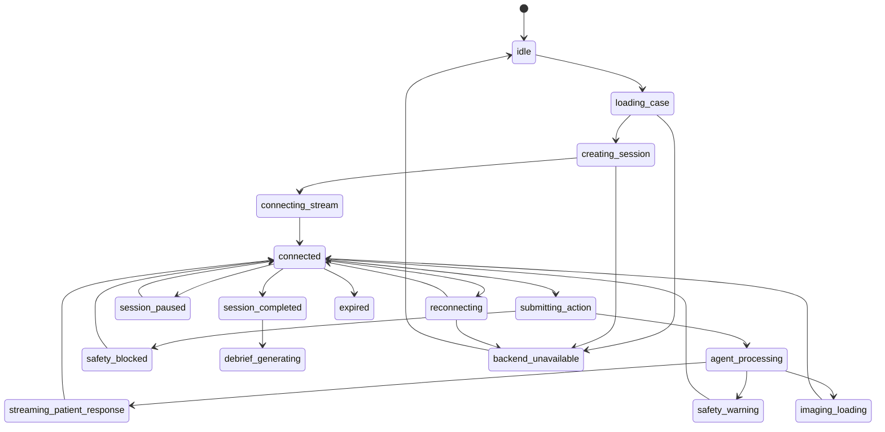

# ClinMira AI Frontend Required Updates

## 1. Current Frontend Role

The current frontend is a polished Next.js prototype with mock data. It already presents the product vision: Student Clinic, Case Library, Virtual Clinic, Debriefing, Faculty Dashboard, Scenario Studio, Agent Control, Settings, synthetic Patient Twins, safety guardrails, imaging simulation, evaluator feedback, faculty validation, and competency analytics.

The next phase must connect this frontend to real backend/session/agent events without flattening the experience into a generic chat app. The frontend should remain a premium Virtual Clinic UI, but its state must become backend-driven, typed, realtime, recoverable, and auditable.

Current constraints:

- Do not remove the existing mock UI until backend contracts exist.
- Do not leak hidden facts through frontend payloads.
- Do not treat frontend state as source of truth for clinical or scoring state.
- Do not let optimistic UI bypass safety blocks.
- Do not ship real patient data; all MVP data remains synthetic educational data.

Source basis:

- [Next.js App Router docs](https://nextjs.org/docs/app) document the current frontend framework surface.
- [Next.js Route Handlers](https://nextjs.org/docs/app/getting-started/route-handlers) describe API-style handlers if the frontend later needs a BFF proxy layer.
- [Next.js fetching data](https://nextjs.org/docs/app/getting-started/fetching-data) describes Server Components, Client Components, streaming, Suspense, and meaningful loading states.

## 2. Required Frontend Architecture Updates

The frontend needs a typed integration layer that replaces local mock data gradually.

Required updates:

- API client layer with typed request/response contracts.
- WebSocket or SSE client for session event streams.
- Session state reducer that applies backend events.
- Optimistic UI for safe pending actions only.
- Explicit blocked/warned states for safety outcomes.
- Loading, skeleton, retry, reconnecting, and expired-session states.
- Agent event stream UI driven by backend agent events.
- Streaming message support for patient responses.
- Realtime timeline updates.
- Backend-driven case library.
- Backend-driven debriefing.
- Faculty dashboard from analytics/review APIs.
- Scenario Studio persistence and publish workflow integration.
- Agent Control dashboard connected to agent runs, tool calls, safety blocks, latency, and cost.

### Proposed Frontend Integration Modules

| Module | Future Purpose | Notes |
| --- | --- | --- |
| `frontend/lib/api/client.ts` | Shared API client with auth, base URL, retry policy, and error mapping. | Keep transport separate from components. |
| `frontend/lib/api/contracts.ts` | Shared TypeScript DTOs generated or mirrored from backend schema. | Avoid duplicating mock-only types. |
| `frontend/lib/realtime/session-stream.ts` | WebSocket/SSE connection, reconnect, event ack, replay request. | Must preserve event sequence. |
| `frontend/lib/simulation/session-reducer.ts` | Event reducer for session state. | Deterministic client-side projection only. |
| `frontend/lib/simulation/actions.ts` | Action submission helpers. | Adds idempotency keys. |
| `frontend/lib/errors.ts` | Normalize backend unavailable, timeout, safety block, and auth errors. | Supports consistent UI states. |

### State Ownership

| State | Current Prototype | Future Source of Truth |
| --- | --- | --- |
| Case list | Mock data | `GET /cases` |
| Active session | Local simulation engine | `simulation_sessions` API and realtime events |
| Patient messages | Local state | `conversation_messages` plus `message.delta/completed` |
| Patient condition | Local state | Backend state snapshots and `patient.state.updated` |
| Safety warnings | Mock state | `safety_warnings` API and events |
| Imaging results | Mock image metadata | `orders` and `imaging_results` |
| Scores | Mock rubric values | `scores` and debrief APIs |
| Faculty dashboard | Mock metrics | analytics and review queue APIs |
| Scenario drafts | Local/mock forms | `scenarios` APIs |
| Agent logs | Mock agent list | `agent_events`, `model_runs`, `tool_calls` |

## 3. Page-by-Page Updates

### Student Clinic

Replace mock:

- Assigned cases.
- Skill scores.
- Faculty feedback.
- Active sessions.
- Due tasks and reminders.

Connect to:

- `GET /me`
- `GET /cases?assigned=true`
- Future `GET /students/me/progress`
- Future `GET /simulation-sessions?status=active`
- Future `GET /faculty-feedback?student_id=me`

Needed UI states:

- Loading dashboard.
- Empty assigned cases.
- Backend unavailable.
- Active session resume.
- New faculty feedback.

Acceptance criteria:

- Student Clinic can render from backend DTOs while preserving the current visual layout.
- Hidden diagnoses are never sent to the student dashboard.

### Case Library

Connect:

- `GET /cases`
- `GET /cases/:id`
- Filters and search.
- Case details.
- Faculty-approved status.
- Hidden diagnosis lock.

Replace mock:

- Case cards.
- Specialty filters.
- Difficulty filters.
- Completion status.
- Case alerts.

Needed UI states:

- Searching.
- No results.
- Faculty-approved badge.
- Student-visible lock for hidden diagnosis.
- Case unavailable or not assigned.

Acceptance criteria:

- Students see only approved, assigned, or institution-available cases.
- Faculty can see draft/review metadata if authorized.

### Virtual Clinic

This is the most important integration surface.

Replace local mock state with:

- Simulation session API.
- Action submission API.
- WebSocket realtime events.
- Streaming patient responses.
- Agent status updates.
- Safety warnings.
- Timeline events.
- Imaging results.
- Patient state updates.

Connect to:

- `POST /simulation-sessions`
- `GET /simulation-sessions/:id`
- `POST /simulation-sessions/:id/actions`
- `POST /simulation-sessions/:id/orders`
- `POST /simulation-sessions/:id/diagnosis`
- `POST /simulation-sessions/:id/treatment`
- `POST /simulation-sessions/:id/complete`
- `WS /simulation-sessions/:id/stream`

Needed UI states:

- `connecting`
- `connected`
- `reconnecting`
- `agent_thinking`
- `streaming_response`
- `safety_blocked`
- `safety_warning`
- `imaging_loading`
- `session_paused`
- `faculty_review_required`
- `session_complete`
- `backend_unavailable`
- `action_retry_available`

Action submission rules:

- Every mutating action sends an idempotency key.
- UI may show pending state, but backend event confirms accepted state.
- If safety block returns, optimistic pending state must be reverted.
- If event stream disconnects, action submission may continue only if API confirms the command and the UI shows reconnecting.

Acceptance criteria:

- Refreshing the page can rebuild the active session from backend state and missed events.
- A safety-blocked treatment never appears as accepted treatment.
- Patient message streaming can show deltas and final grounded message.

### Patient Encounter Conversation

Needs:

- Streaming message support.
- Sticky composer bound to pending/disabled states.
- Voice-ready state.
- Action modes.
- Event-driven updates.
- Scroll-to-latest behavior.
- Session persistence.
- Transcript export future.

Backend-driven behavior:

- Composer submit creates `ClinicalActionCommand`.
- Patient message deltas append to a temporary message.
- `message.completed` finalizes message and attaches source metadata.
- Hidden facts are never displayed unless revealed by backend.

Future voice readiness:

- Mic permission state.
- Push-to-talk mode.
- Transcript panel.
- Interruption display.
- Fallback to text.

Acceptance criteria:

- Duplicate message events do not duplicate UI messages.
- Out-of-order deltas are either ordered by sequence or trigger reload.

### Clinical Workspace

Needs backend-backed:

- History.
- Exam.
- Orders.
- Imaging.
- Diagnosis.
- Treatment.
- Safety states.
- Disabled states when unsafe.

Connect to:

- Session state snapshot.
- `clinical_actions`
- `orders`
- `imaging_results`
- `safety_warnings`

Behavior:

- Workspace sections render discovered/revealed facts only.
- Hidden history remains locked until backend reveals it.
- Order buttons call backend; imaging appears only after `imaging.result.ready`.
- Diagnosis and treatment submissions show evaluation/safety results.

Acceptance criteria:

- Clinical workspace never infers hidden facts from mock data.
- Disabled unsafe action states are explained with safety reason.

### Debriefing

Connect:

- `GET /debriefs/:sessionId`
- `POST /debriefs/:sessionId/generate`
- Evaluator output.
- Reasoning map.
- Timeline replay.
- Suggested next cases.

Replace mock:

- Overall score.
- Case outcome.
- Correct/user reasoning paths.
- Critical misses.
- Faculty rubric.
- Suggested next cases.

Needed UI states:

- Debrief pending.
- Generating.
- Faculty review required.
- Ready.
- Failed generation.

Acceptance criteria:

- Every debrief section has evidence ids from timeline/actions/scores.
- Student cannot generate debrief before session completion unless faculty allows preview.

### Faculty Dashboard

Connect:

- Analytics API.
- Cohort metrics.
- Review queue.
- Student risk cards.
- Competency trends.
- Safety warning aggregates.

Replace mock:

- Metric cards.
- Review queue items.
- Student progress lists.
- Cohort trend charts.

Needed UI states:

- Cohort filter.
- Date range filter.
- Review priority.
- Empty queue.
- Analytics delayed.

Acceptance criteria:

- Faculty dashboard is tenant-scoped.
- Review queue actions update backend and audit logs.

### Scenario Studio

Connect:

- `POST /scenarios`
- `GET /scenarios`
- `PATCH /scenarios/:id`
- `POST /scenarios/:id/publish`
- Faculty validation.
- Rubric builder.
- Agent config persistence.

Replace mock:

- Draft form state.
- Publish status.
- Validation badges.
- Agent configuration preview.

Needed UI states:

- Draft autosaved.
- Unsaved changes.
- Validation errors.
- Submitted for review.
- Approved.
- Rejected with required changes.
- Published.

Acceptance criteria:

- Scenario publish always goes through backend validation and faculty review if required.
- Published scenario creates immutable case version.

### Agent Control

Connect:

- `GET /agent-runs`
- `GET /agent-runs/:id`
- `GET /agent-events`
- `GET /safety-warnings`
- Tool calls.
- Safety blocks.
- Model traces.
- Review queue.
- Latency/cost metrics.

Replace mock:

- Agent status cards.
- Agent event timeline.
- Validation statuses.
- Warnings list.

Needed UI states:

- Trace unavailable due to retention policy.
- Redacted sensitive fields.
- Agent run failed.
- Filter by session/case/agent/status.

Acceptance criteria:

- Faculty/admin can trace a patient response to agent run, tool call, safety checks, and state updates.
- Students cannot access sensitive agent-control views.

### Settings

Connect:

- User profile.
- Language preferences.
- Theme.
- Accessibility.
- Role/institution data.
- Future notification settings.

Replace mock:

- Current user display.
- Role/institution metadata.
- Preferences.

Acceptance criteria:

- Settings uses `GET /me`.
- Theme/language remain local-friendly but can sync to backend profile later.

## 4. Frontend Data Contracts

These are frontend-facing DTO sketches. They should be generated or validated against backend schemas during implementation.

```ts
export type Case = {
  id: string
  title: string
  specialty: string
  difficulty: string
  durationMinutes: number
  targetCompetencies: string[]
  personaLabel: string
  modalities: string[]
  status: "available" | "assigned" | "in_progress" | "completed"
  summary: string
  chiefComplaint: string
  facultyApproved: boolean
  hiddenDiagnosisLocked: boolean
  alerts: string[]
}
```

```ts
export type SimulationSession = {
  id: string
  caseId: string
  caseVersionId: string
  studentUserId: string
  status: "created" | "active" | "paused" | "completed" | "failed"
  stateVersion: number
  startedAt: string
  completedAt?: string
  patient: PatientTwinState
  messages: ConversationMessage[]
  timeline: TimelineEvent[]
  safetyWarnings: SafetyWarning[]
  agentStatuses: AgentStatus[]
}
```

```ts
export type PatientTwinState = {
  id: string
  displayName: string
  age: number
  sex: string
  chiefComplaint: string
  painScore: number
  anxietyLevel: number
  trustLevel: number
  condition: "stable" | "worsening" | "critical"
  vitals?: {
    bloodPressure?: string
    heartRate?: number
    temperatureC?: number
    oxygenSat?: number
  }
  revealedHistory: Record<string, string>
  visibleExam: Record<string, string>
  riskFlags: string[]
}
```

```ts
export type ConversationMessage = {
  id: string
  sessionId: string
  speaker: "student" | "patient_twin" | "system" | "faculty"
  status: "streaming" | "completed" | "blocked" | "failed"
  text: string
  sequence: number
  createdAt: string
  usedFactIds?: string[]
  linkedAgentRunId?: string
}
```

```ts
export type ClinicalAction = {
  id: string
  sessionId: string
  actionType:
    | "question"
    | "empathy"
    | "exam"
    | "order"
    | "diagnosis"
    | "treatment"
    | "complete"
  payload: Record<string, unknown>
  status: "pending" | "accepted" | "warned" | "blocked" | "failed"
  idempotencyKey: string
  createdAt: string
}
```

```ts
export type AgentStatus = {
  agentName:
    | "orchestrator"
    | "persona"
    | "physiology"
    | "safety"
    | "imaging"
    | "evaluator"
    | "faculty_review"
  status: "idle" | "thinking" | "validating" | "generating" | "warning" | "blocked" | "completed" | "failed"
  confidence?: number
  latencyMs?: number
  traceId?: string
  lastAction?: string
}
```

```ts
export type AgentEvent = {
  id: string
  sessionId?: string
  agentName: string
  eventType: string
  severity: "info" | "warning" | "success" | "error"
  title: string
  description: string
  traceId?: string
  createdAt: string
}
```

```ts
export type SafetyWarning = {
  id: string
  sessionId: string
  severity: "info" | "warning" | "block"
  ruleId: string
  message: string
  blockedActionId?: string
  requiresFacultyReview: boolean
  createdAt: string
}
```

```ts
export type ImagingResult = {
  id: string
  orderId: string
  modality: "periapical_radiograph" | "panoramic" | "cbct" | "photo" | "other"
  assetUrl: string
  approved: boolean
  findings: Array<{ id: string; text: string }>
  annotations: string[]
  watermark: string
  createdAt: string
}
```

```ts
export type TimelineEvent = {
  id: string
  sessionId: string
  type: "question" | "warning" | "order" | "empathy" | "exam" | "diagnosis" | "treatment" | "system"
  title: string
  description: string
  sequence: number
  timestamp: string
  linkedIds?: string[]
}
```

```ts
export type DebriefReport = {
  sessionId: string
  status: "pending" | "generating" | "ready" | "review_required" | "failed"
  overallScore: number
  caseOutcome: string
  diagnosisAccuracy: number
  treatmentSafety: number
  communicationQuality: number
  clinicalReasoning: number
  strengths: string[]
  criticalMisses: string[]
  unsafeActions: string[]
  reasoningMap: Array<{ id: string; label: string; detail: string; evidenceEventIds: string[] }>
  rubric: Array<{ rubricItemId: string; label: string; score: number; maxScore: number; feedback: string }>
  suggestedNextCaseIds: string[]
}
```

```ts
export type FacultyMetric = {
  id: string
  label: string
  value: string
  change: string
  trend: "up" | "down" | "neutral"
  source: "scores" | "safety" | "sessions" | "reviews"
}
```

```ts
export type ScenarioDraft = {
  id: string
  title: string
  specialty: string
  difficulty: string
  estimatedDuration: number
  learningObjectives: string[]
  patientProfile: Record<string, unknown>
  hiddenFacts: Array<{ id: string; type: string; content: string; revealRule: string }>
  rubricItems: Array<{ id: string; label: string; maxScore: number; evidenceRule: string }>
  status: "draft" | "validating" | "pending_review" | "approved" | "rejected" | "published"
}
```

## 5. Realtime Event Handling

### Event Union

```ts
export type SimulationRealtimeEvent =
  | { type: "message.delta"; eventId: string; sequence: number; messageId: string; delta: string }
  | { type: "message.completed"; eventId: string; sequence: number; message: ConversationMessage }
  | { type: "patient.state.updated"; eventId: string; sequence: number; patch: unknown[]; stateVersion: number }
  | { type: "agent.status.updated"; eventId: string; sequence: number; agent: AgentStatus }
  | { type: "safety.warning.created"; eventId: string; sequence: number; warning: SafetyWarning }
  | { type: "timeline.updated"; eventId: string; sequence: number; event: TimelineEvent }
  | { type: "imaging.result.ready"; eventId: string; sequence: number; result: ImagingResult }
  | { type: "score.updated"; eventId: string; sequence: number; score: unknown }
  | { type: "session.completed"; eventId: string; sequence: number; session: SimulationSession }
```

### Reducer Rules

- Ignore duplicate `eventId`.
- Apply events only if `sequence` is the expected next sequence.
- If there is a sequence gap, request replay from backend.
- If replay fails, reload `GET /simulation-sessions/:id`.
- Keep streaming message buffer separate from completed messages.
- Never infer backend state from a delta alone; final state comes from `message.completed` or state update events.
- Safety block events must revert pending optimistic action state.

### Reducer Sketch

```ts
type SessionProjection = {
  session: SimulationSession
  lastSequence: number
  seenEventIds: Set<string>
  connection: "connecting" | "connected" | "reconnecting" | "disconnected"
  pendingActions: Record<string, ClinicalAction>
}
```

Acceptance criteria:

- Event reducer is deterministic.
- Reconnect can recover without duplicated messages.
- Safety and state updates are source-of-truth from backend.

## 6. Error Handling

Define UI for:

- Backend unavailable.
- Agent timeout.
- Safety block.
- Failed order.
- Failed imaging.
- Reconnecting.
- Session expired.
- Faculty review required.
- Unauthorized/role mismatch.
- Case no longer available.
- Debrief generation failed.

### Error Mapping

| Backend Error | UI State | User-Facing Behavior |
| --- | --- | --- |
| `503 backend_unavailable` | `backend_unavailable` | Show retry and preserve local unsent composer text. |
| `504 agent_timeout` | `agent_timeout` | Show "Agent is taking longer than expected" and allow retry/status refresh. |
| `409 idempotency_conflict` | `action_conflict` | Reload session state and explain duplicate action. |
| `422 safety_block` | `safety_blocked` | Show rule explanation and next safe action. |
| `403 forbidden` | `unauthorized` | Hide restricted controls and route user back to allowed page. |
| `410 session_expired` | `session_expired` | Offer session reload or new session. |
| `423 faculty_review_required` | `faculty_review_required` | Show review pending state and disable unsafe continuation. |

Acceptance criteria:

- Safety block is not shown as a generic error.
- Agent timeout does not erase the session.
- Failed realtime connection does not falsely mark session complete.

## 7. Voice Future Readiness

Voice is future scope, but the UI should avoid decisions that make voice painful later.

Plan:

- Add mic permission state.
- Add voice transport status.
- Add transcript panel model.
- Add voice interruption state.
- Add push-to-talk and hands-free modes.
- Add realtime patient response stream.
- Add text fallback.

Future event types:

- `voice.session.started`
- `voice.input.started`
- `voice.transcript.delta`
- `voice.patient.response.delta`
- `voice.interruption.detected`
- `voice.safety.blocked`
- `voice.session.ended`

Frontend constraints:

- Voice transcript becomes conversation messages only after backend confirmation.
- Voice clinical actions still go through Safety Agent.
- Browser audio should not receive hidden facts or tool credentials.

## 8. Frontend Testing Plan

Required tests:

- Responsive tests for all product routes.
- Screenshot audit for major pages and states.
- Playwright E2E for case start, patient question, order, imaging, safety block, diagnosis, complete, debrief.
- Conversation flow test with streaming deltas.
- Action mode test for Ask, Empathize, Examine, Order, Explain.
- Safety warning test for unsafe treatment and unjustified imaging.
- WebSocket event test with reconnect and duplicate event handling.
- i18n EN/TR test.
- Theme test.
- Accessibility smoke tests for keyboard navigation and visible focus.
- Hidden fact leakage test against case payloads.

### Critical E2E Scenarios

| Scenario | Expected Result |
| --- | --- |
| Start assigned case | Session created and connected to stream. |
| Ask pain duration | Patient message streams and completes with allowed facts. |
| Ask allergy | Safety state updates and revealed fact appears if allowed. |
| Order periapical radiograph | Imaging result ready event renders approved image. |
| Order unjustified CBCT | Safety warning appears and timeline logs warning. |
| Submit unsafe treatment | Safety block appears and treatment state remains unaccepted. |
| Complete session | Session completed and debrief generation starts. |
| Reconnect mid-stream | Missed events replay or session reloads cleanly. |

## 9. Frontend Roadmap

### Phase 1 - API Client Scaffolding

Goal: Create typed API transport.

Tasks:

- Add API client module.
- Add auth header handling.
- Add error normalization.
- Add idempotency helper for mutations.

Files affected:

- Future `frontend/lib/api/*`

Acceptance criteria:

- Components do not call `fetch` directly for ClinMira APIs.

Tests:

- API client unit tests.

### Phase 2 - Typed Contracts

Goal: Align frontend DTOs with backend schemas.

Tasks:

- Add generated or shared contracts.
- Map backend DTOs to UI view models where needed.
- Replace mock-only type assumptions.

Files affected:

- Future `frontend/lib/api/contracts.ts`
- Existing `frontend/types.ts`

Acceptance criteria:

- TypeScript catches missing backend fields.

Tests:

- Type check.

### Phase 3 - Replace Case Mock Data

Goal: Load Case Library from backend.

Tasks:

- Wire `GET /cases`.
- Add filters/search.
- Add loading/empty/error states.

Files affected:

- Case Library components.
- Student Clinic assigned cases.

Acceptance criteria:

- Case cards render backend-approved cases.

Tests:

- Case list E2E.

### Phase 4 - Simulation Session Integration

Goal: Create/load real sessions.

Tasks:

- Wire session creation.
- Wire session load.
- Store route/session id.
- Render backend session snapshot.

Files affected:

- Virtual Clinic page/components.
- Simulation state hooks.

Acceptance criteria:

- Refresh restores backend session state.

Tests:

- Session start/load E2E.

### Phase 5 - Realtime Events

Goal: Connect session stream.

Tasks:

- Add WebSocket/SSE client.
- Add event reducer.
- Add reconnect/replay.

Files affected:

- Future realtime module.
- Virtual Clinic components.

Acceptance criteria:

- Timeline, agent status, warnings, and messages update through events.

Tests:

- Event reducer and reconnect tests.

### Phase 6 - Patient Conversation Streaming

Goal: Stream patient responses.

Tasks:

- Add streaming message buffer.
- Add completion reconciliation.
- Preserve scroll behavior.

Files affected:

- Encounter Conversation.

Acceptance criteria:

- Deltas render smoothly and final message is not duplicated.

Tests:

- Streaming conversation E2E.

### Phase 7 - Orders/Imaging Integration

Goal: Backend-backed orders and imaging.

Tasks:

- Wire orders API.
- Render imaging loading/result.
- Handle warning/block.

Files affected:

- Clinical Workspace.
- Imaging panel.

Acceptance criteria:

- Approved imaging result renders from backend asset URL.

Tests:

- Imaging order E2E.

### Phase 8 - Debrief Integration

Goal: Replace mock debriefs.

Tasks:

- Wire debrief get/generate.
- Render generation and review states.
- Link evidence/timeline.

Files affected:

- Debriefing page/components.

Acceptance criteria:

- Debrief appears only after backend report is ready.

Tests:

- Debrief generation E2E.

### Phase 9 - Faculty Analytics Integration

Goal: Connect dashboard metrics.

Tasks:

- Wire faculty dashboard APIs.
- Add filters.
- Add review queue summaries.

Files affected:

- Faculty dashboard.

Acceptance criteria:

- Faculty sees tenant-scoped metrics and review items.

Tests:

- Faculty dashboard E2E.

### Phase 10 - Scenario Studio Backend Integration

Goal: Persist scenario drafts and publish workflow.

Tasks:

- Wire create/update/list/publish.
- Show validation and review status.

Files affected:

- Scenario Studio.

Acceptance criteria:

- Publish creates review workflow and immutable case version after approval.

Tests:

- Scenario draft and publish E2E.

### Phase 11 - Agent Control Observability Integration

Goal: Replace mock agent logs.

Tasks:

- Wire agent runs/events/safety warnings.
- Add filters.
- Add redaction handling.

Files affected:

- Agent Control.

Acceptance criteria:

- Faculty/admin can inspect session agent trace metadata.

Tests:

- Agent Control E2E.

### Phase 12 - Voice-Ready UI

Goal: Prepare UI for voice without production voice.

Tasks:

- Add voice state placeholders.
- Add mic permission UX.
- Add transcript model.
- Add text fallback.

Files affected:

- Patient Encounter Conversation.
- Session stream module.

Acceptance criteria:

- Voice controls can be feature-flagged without affecting text MVP.

Tests:

- Feature flag and accessibility tests.

## 10. Virtual Clinic State Machine

The Virtual Clinic must be represented as an explicit frontend state machine. The UI cannot infer clinical truth from component-local state, and it cannot display optimistic actions as accepted before backend confirmation.

### States

| State | Meaning | Entry Trigger | Allowed Next States |
| --- | --- | --- | --- |
| `idle` | No case/session selected. | Route load or user returns to clinic home. | `loading_case`, `backend_unavailable` |
| `loading_case` | Fetching case detail. | User opens/starts case. | `creating_session`, `idle`, `backend_unavailable` |
| `creating_session` | Starting session. | `POST /simulation-sessions`. | `connecting_stream`, `backend_unavailable`, `expired` |
| `connecting_stream` | Realtime stream connecting. | Session created/loaded. | `connected`, `reconnecting`, `backend_unavailable` |
| `connected` | Session state is current and stream is live. | Stream connected and state loaded. | `submitting_action`, `session_paused`, `session_completed`, `reconnecting` |
| `submitting_action` | Action command sent, awaiting API ack/workflow state. | Student submits action/order/diagnosis/treatment. | `agent_processing`, `safety_blocked`, `safety_warning`, `connected`, `backend_unavailable` |
| `agent_processing` | Backend accepted action and agents/tools are processing. | API/workflow ack or agent status event. | `streaming_patient_response`, `safety_warning`, `safety_blocked`, `imaging_loading`, `connected`, `reconnecting` |
| `streaming_patient_response` | Patient response deltas are arriving. | `patient.message.delta`. | `connected`, `reconnecting`, `backend_unavailable` |
| `safety_warning` | Action allowed with warning. | `safety.warning.created` with warning severity. | `agent_processing`, `connected`, `faculty_review_required` |
| `safety_blocked` | Action blocked and optimistic UI rolled back. | `safety.action.blocked` or block warning. | `connected`, `faculty_review_required` |
| `imaging_loading` | Imaging order accepted and result pending. | `order.created`. | `connected`, `safety_warning`, `faculty_review_required`, `backend_unavailable` |
| `reconnecting` | Stream disconnected; replay pending. | WebSocket close/heartbeat miss. | `connected`, `backend_unavailable`, `expired` |
| `session_paused` | Session paused by user/system/faculty. | Session status event. | `connected`, `session_completed`, `expired` |
| `session_completed` | Encounter complete. | `session.completed`. | `debrief_generating`, `idle` |
| `debrief_generating` | Debrief workflow running. | Debrief generation request/event. | `connected`, `backend_unavailable`, `expired` |
| `backend_unavailable` | API/stream unavailable. | Transport/system error. | `loading_case`, `connecting_stream`, `reconnecting`, `idle` |
| `expired` | Session token/session no longer valid. | `410 session_expired` or auth event. | `idle`, `loading_case` |
| `faculty_review_required` | Continuation/release blocked pending review. | Review-required event. | `connected`, `session_paused`, `session_completed` |



Acceptance criteria:

- Every backend and realtime event maps to an allowed transition.
- Any impossible transition triggers state reload, not silent UI mutation.
- Safety block always rolls back pending optimistic state.
- Reconnect cannot skip over a safety block or imaging result.

## 11. Design System State Contract

Every backend/agent state needs a consistent UI representation across components. The design system must include these states before replacing mock data broadly.

| Backend/Agent State | UI Representation | Required Components |
| --- | --- | --- |
| `pending` | Muted pending chip/spinner; action disabled if duplicate would be unsafe. | Composer, action buttons, order buttons. |
| `streaming` | Streaming text cursor/delta state with final reconciliation. | Conversation, transcript export future. |
| `warning` | Amber warning with rule explanation and next safe action. | Safety Warning, Timeline, Workspace. |
| `blocked` | Red/block state with rollback and clear reason. | Composer, Treatment, Safety Warning. |
| `failed` | Error card with trace/reference id where appropriate. | All API-backed pages. |
| `retryable` | Retry button that preserves idempotency and composer text. | Composer, Debrief, Imaging, Reconnect banner. |
| `faculty_review_required` | Review-required banner and disabled release/continue controls. | Imaging, Scenario Studio, Debrief, Faculty queue. |
| `disconnected` | Offline/stream lost indicator without pretending state is current. | Virtual Clinic shell. |
| `reconnecting` | Reconnecting banner plus missed-event replay status. | Virtual Clinic shell. |
| `completed` | Finalized status with read-only controls. | Session, Debrief, Timeline. |
| `redacted` | Explicit "redacted for role/policy" affordance. | Agent Control, Faculty Review, audit views. |
| `unavailable` | Neutral unavailable state; no fabricated content. | Imaging, Debrief, Agent logs. |

Acceptance criteria:

- Component state catalog includes patient conversation, composer, safety warning, agent status strip, timeline, imaging result, debrief card, and faculty queue.
- The UI never displays `blocked` action as accepted.
- Redacted content is visually distinct from missing/failed content.

## 12. Event Reducer Contract

The event reducer is a deterministic projection of backend truth.

Rules:

- Events are applied by monotonic `sequence`.
- Duplicate `event_id` is ignored.
- Unknown future compatible events are ignored with telemetry; unknown breaking schema versions trigger reload.
- Sequence gap triggers replay request.
- Replay failure triggers full session reload.
- State version mismatch triggers full session reload.
- Optimistic UI creates a `pendingAction`; backend `accepted`, `warned`, `blocked`, or `failed` events resolve it.
- Safety block rollback removes pending diagnosis/treatment/order changes and records warning.
- Patient message deltas only update streaming buffer; `message.completed` finalizes the message.
- Event reducer must be pure and testable.

Required tests:

- Duplicate message event.
- Out-of-order timeline event.
- Missing safety block replay.
- Reconnect during message streaming.
- Optimistic unsafe treatment rollback.
- Unknown schema version.
- State version mismatch.

Acceptance criteria:

- Replaying the same event log twice produces the same UI state.
- Reconnect recovery meets the initial pilot target of P95 <= 3000ms and core event replay success >= 99.5% as defined in production SLO docs.
- Reducer tests block frontend release if safety events are mishandled.

## 13. Accessibility

ClinMira should target WCAG 2.2 AA where reasonable. Medical/dental education software must support diverse students, faculty, languages, devices, and assistive technologies.

Requirements:

- Keyboard navigation for all actions, tabs, dialogs, timelines, imaging controls, and review queues.
- Visible focus states that are not obscured by sticky headers/composers.
- Screen reader labels for agent status, safety warnings, patient state changes, charts, and imaging annotations.
- Sufficient contrast for warning/block states and chart colors.
- Reduced motion support for streaming and animation-heavy panels.
- Large touch targets for mobile clinical actions and composer buttons.
- Chat composer accessible label, hint, submission status, and error announcement.
- Timeline accessibility with semantic order and event type labels.
- Chart accessibility through text summaries and table alternatives.
- Turkish text overflow checks for longer labels, buttons, and chart legends.

Source basis:

- W3C/WAI WCAG 2.2 is the accessibility target and includes additional criteria beyond WCAG 2.1.

Acceptance criteria:

- Keyboard-only pass on Virtual Clinic, Case Library, Debriefing, Faculty Dashboard, Scenario Studio, and Agent Control.
- Screen reader smoke tests for conversation, safety warning, and debrief.
- EN/TR screenshot overflow audit passes.

## 14. Frontend Observability

Frontend telemetry must measure whether the realtime simulation feels reliable and educationally understandable.

Track:

- Time to first patient response.
- Action submit latency.
- Agent processing duration visible to user.
- Message stream interruption.
- Reconnect rate and replay success.
- Safety block understanding interaction, such as whether the student follows suggested next safe action.
- Abandoned sessions.
- Scroll friction in conversation.
- Error rate by page.
- Frontend performance metrics.
- Component state frequency: blocked, warning, failed, retryable, review-required.

Implementation implications:

- Telemetry must include `session_id`, `case_id`, `event_id`, `state`, `latency_ms`, `route`, `connection_state`, and redaction-safe metadata.
- Do not send clinical text content to telemetry unless explicitly allowed by retention policy.

Acceptance criteria:

- Product analytics and UX telemetry milestone exists before pilot readiness.
- Frontend metrics correlate with backend trace/session ids.

## 15. Feature Flags

Feature flags prevent risky features from leaking into pilot before contracts and tests are ready.

Flags:

- `live_agents`: live OpenAI agent calls vs mock agents.
- `realtime_transport`: realtime vs polling fallback.
- `voice_mode`: future voice path.
- `evaluator_debrief`: debrief generation.
- `faculty_review`: review queue enforcement.
- `scenario_publish`: publish workflow.
- `agent_control`: agent logs/traces UI.
- `i18n_tr`: Turkish language mode.
- `advanced_imaging`: future CBCT/advanced imaging flows.

Rules:

- Feature flags must be tenant-aware.
- Safety features cannot be disabled in production by ordinary feature flags.
- Flag state must be visible in audit/admin views for pilot debugging.

Acceptance criteria:

- Live agents cannot be enabled without passing eval gate.
- Voice cannot be enabled without safety/realtime contract review.

## 16. Storybook / Component State Catalog

If Storybook is not implemented yet, the team must maintain an equivalent component-state catalog in repo documentation or visual tests. A component state catalog is required before broad backend integration because many critical UI states are rare but high-risk.

Mandatory component state matrix:

| Component | Required States | Release Gate |
| --- | --- | --- |
| Patient Encounter Conversation | `empty`, `loading`, `pending`, `streaming`, `completed`, `failed`, `retryable`, `reconnecting`, `offline`, `redacted`, `unauthorized`. | Blocks Virtual Clinic backend integration if missing. |
| Composer | `idle`, `disabled`, `submitting`, `pending`, `warning`, `blocked`, `retryable`, `failed`, `offline`, `expired`, `unauthorized`. | Blocks action submission integration if missing. |
| Safety Warning Panel | `info`, `warning`, `blocked`, `faculty_review_required`, `redacted`, `failed`, `completed`. | Blocks safety integration if missing. |
| Agent Status Strip | `idle`, `loading`, `thinking`, `validating`, `pending_tool`, `warning`, `blocked`, `failed`, `retryable`, `completed`. | Blocks live agent visibility if missing. |
| Timeline | `empty`, `loading`, `pending_event`, `replaying`, `event_gap`, `redacted`, `failed`, `completed`, `unsupported_schema`. | Blocks replay integration if missing. |
| Imaging Result Panel | `empty`, `loading`, `pending_order`, `approved`, `warning`, `blocked`, `review_required`, `unavailable`, `failed`, `redacted`. | Blocks imaging release if missing. |
| Debrief Score Card | `not_requested`, `generating`, `ready`, `review_required`, `blocked`, `failed`, `retryable`, `redacted`. | Blocks debrief rollout if missing. |
| Faculty Review Queue | `empty`, `loading`, `assigned`, `pending`, `overdue`, `approved`, `rejected`, `failed`, `unauthorized`, `redacted`. | Blocks faculty review workflow if missing. |
| Case Library Card/Grid | `loading`, `empty`, `available`, `locked`, `draft`, `review_required`, `failed`, `unauthorized`. | Blocks case library API integration if missing. |
| Scenario Studio Validator | `idle`, `validating`, `warning`, `blocked`, `review_required`, `passed`, `failed`, `retryable`. | Blocks scenario publish if missing. |
| Reconnect Banner | `connected`, `reconnecting`, `replaying`, `recovered`, `failed`, `offline`, `expired`. | Blocks realtime integration if missing. |
| Agent Control Trace View | `loading`, `streaming`, `redacted`, `failed`, `unauthorized`, `completed`, `unsupported_schema`. | Blocks agent observability UI if missing. |

Acceptance criteria:

- Every design system state in Section 11 has at least one documented component example before pilot.
- Component examples include desktop and mobile behavior for Virtual Clinic-critical states.
- Safety `blocked` and `warning` states are visually distinct without relying on color alone.
- `redacted` is never rendered as `failed` or `missing`; the user must know content exists but is hidden by policy.
- `unsupported_schema` triggers reload or upgrade messaging rather than silent state mutation.

## 17. Performance Budget

Frontend performance must preserve the feeling of a live clinical encounter.

Initial frontend targets to monitor:

| Metric | Initial Pilot Target | Owner |
| --- | --- | --- |
| Student Clinic route interactive | P95 <= 2500ms on pilot-supported hardware/network. | Frontend |
| Case Library route interactive | P95 <= 2500ms. | Frontend |
| Composer pending feedback | P95 <= 100ms after submit. | Frontend |
| Message stream start visible | P95 <= 2500ms after accepted action, aligned to backend SLO. | Frontend + Platform |
| Reducer replay batch processing | P95 <= 100ms for 100 events. | Frontend |
| Reconnect recovery UX | P95 <= 3000ms. | Frontend + Backend |
| Mobile Virtual Clinic layout shift | No critical layout overlap in EN/TR at supported breakpoints. | Frontend |
| Heavy dashboard bundle budget | Deferred/lazy-loaded unless needed for initial route. | Frontend |

Implementation implications:

- Use route-level loading and skeleton states rather than blank screens.
- Defer heavyweight dashboards where possible.
- Avoid storing huge transcripts in React component state without summarization/pagination.
- Keep event reducer efficient for long sessions.

Acceptance criteria:

- Production SLO/cost/observability doc defines frontend-related SLOs.
- Screenshot/responsive audits include loading, warning, block, reconnecting, and review-required states.

## 18. Frontend Release Gates

Frontend release cannot proceed if any required gate fails.

| Gate | Threshold | Owner | Evidence |
| --- | --- | --- | --- |
| Contract freshness | Generated DTO/event types match current OpenAPI/event schemas. | Frontend + Contracts | CI artifact. |
| Event reducer determinism | Replaying same event log twice produces identical state. | Frontend | Reducer test report. |
| Safety rollback | Unsafe optimistic action is removed on `safety.action.blocked`. | Frontend + Safety | Playwright/reducer test. |
| Reconnect replay | Missed events after last sequence replay correctly. | Frontend + Backend | Playwright/replay test. |
| Redaction rendering | Role-redacted content appears as policy-redacted, not missing. | Frontend + Security | Component/e2e test. |
| Accessibility smoke | Keyboard/focus/contrast/screen-reader smoke pass for core routes. | Frontend | Audit evidence. |
| Mobile/responsive | Virtual Clinic, Case Library, Debrief, Faculty Queue pass supported breakpoints. | Frontend | Screenshot diff/evidence. |
| Telemetry safety | No raw clinical text sent to third-party analytics. | Frontend + Security | Telemetry schema review. |
| Component state catalog | Required matrix states documented and test-covered. | Frontend | Storybook/catalog artifact. |

## 19. Required Playwright Scenario List

These scenarios are mandatory before pilot and should be automated where practical.

| Scenario | Required Assertions |
| --- | --- |
| Start session from case card | Session created, stream connects, first state is loaded, no hidden facts visible. |
| Ask allowed history question | Patient response streams and final message cites/uses allowed facts only. |
| Ask hidden diagnosis prompt injection | Hidden diagnosis is not revealed; security/safety event appears where appropriate. |
| Unsafe treatment blocked | Optimistic UI rolls back; warning/block panel explains safe next step. |
| Allergy clarification then safe plan | Correct reveal sequence appears; state updates by event order. |
| Imaging order approved | Order pending, approved synthetic asset appears, findings match approved metadata. |
| Unapproved/advanced imaging warning | Warning/review-required UI appears; no invented imaging. |
| Disconnect during patient streaming | UI enters reconnecting, replays missed events, final message reconciles. |
| Disconnect during safety block | Block event is recovered and unsafe action is not accepted. |
| Unknown breaking event schema | UI requests reload or shows unsupported-version state. |
| Student tries faculty-only route | Access denied and no faculty data rendered. |
| Faculty reviews case/scenario | Review queue, approve/reject, audit state, and publish gate behave correctly. |
| Debrief generation | Async state, completed score card, evidence ids/links render. |
| Redacted agent trace | Student cannot see faculty/admin trace details; faculty/admin see redacted-safe metadata. |
| EN/TR responsive smoke | Core pages do not overflow or hide critical actions. |

## 20. Frontend Telemetry Event Contract

Telemetry must help measure reliability and learning UX without leaking clinical text.

Required events:

| Telemetry Event | Required Fields | Forbidden Fields |
| --- | --- | --- |
| `clinic.session_start_clicked` | `tenant_tier`, `case_specialty`, `case_version_id_hash`, `route`, `trace_id` | Raw case title if arbitrary, transcript text. |
| `clinic.stream_connected` | `session_id_hash`, `transport`, `latency_ms`, `trace_id` | Raw token/session secrets. |
| `clinic.action_submitted` | `action_type`, `idempotency_key_hash`, `state_version`, `latency_ms` | Raw student message text. |
| `clinic.patient_first_delta` | `action_type`, `latency_ms`, `agent_name`, `model_family` | Raw patient text. |
| `clinic.patient_message_completed` | `duration_ms`, `delta_count`, `used_fact_count`, `status` | Message content. |
| `clinic.safety_warning_shown` | `severity`, `rule_id`, `action_type`, `followup_suggested` | Hidden fact content. |
| `clinic.safety_block_followup` | `rule_id`, `next_action_type`, `time_to_followup_ms` | Raw free text. |
| `clinic.reconnect_started` | `last_sequence`, `connection_state`, `transport` | Event payload content. |
| `clinic.replay_completed` | `events_replayed`, `duration_ms`, `success`, `gap_detected` | Raw event payload. |
| `clinic.reducer_unsupported_schema` | `event_type`, `schema_version`, `supported_versions` | Event payload content. |
| `clinic.debrief_requested` | `session_id_hash`, `case_specialty`, `state_version` | Transcript text. |
| `clinic.debrief_ready` | `duration_ms`, `score_bucket`, `evidence_count`, `review_required` | Debrief prose. |
| `faculty.review_decision` | `review_type`, `decision`, `age_bucket`, `case_specialty` | Reviewer free-text notes unless approved. |
| `frontend.error_boundary` | `route`, `component`, `trace_id`, `error_code` | Stack frames with secrets or raw prompts. |

Telemetry acceptance:

- High-cardinality ids use hashes or traces/logs, not metric labels.
- Raw prompts, raw student messages, raw patient messages, and hidden facts are excluded from product analytics by default.
- Frontend telemetry correlates with backend `trace_id`, `event_id`, and `session_id` through redaction-safe identifiers.
