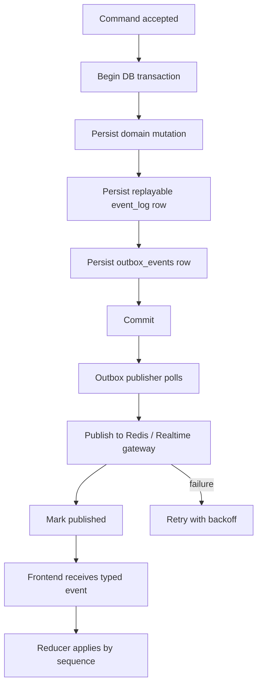

# Event Reliability and Contract Governance

## Purpose

ClinMira is realtime and session-based. No clinical action, safety warning, patient message, timeline event, score update, faculty review request, or imaging result should be lost because a process crashed, a socket disconnected, or Redis dropped an ephemeral Pub/Sub message.

This document defines the event reliability and contract governance foundation. It is mandatory before production-like realtime simulation.

Core rule:

- No state mutation is considered complete until event persistence, replay behavior, schema version, authorization, and duplicate handling are defined.

Source basis:

- PostgreSQL transactions support atomic mutation plus outbox write.
- Redis Pub/Sub is at-most-once and must not be source of truth.
- Redis Streams support replay and consumer-group concepts, but PostgreSQL remains authoritative.
- OpenAPI defines machine-readable HTTP contracts.
- Pydantic JSON Schema and generated TypeScript types support cross-service contract alignment.

## Transactional Outbox Pattern

The transactional outbox prevents lost events by writing an event record in the same database transaction as the state mutation.

### Exact Flow

1. API/BFF or agent activity validates command and idempotency key.
2. Service starts a PostgreSQL transaction.
3. Service writes domain mutation such as `clinical_actions`, `session_state_snapshots`, `safety_warnings`, or `timeline_events`.
4. Service writes `event_log` record if event is replayable.
5. Service writes `outbox_events` record with event payload and schema version.
6. Transaction commits.
7. Publisher worker polls unpublished outbox events.
8. Publisher sends event to Redis Pub/Sub, Redis Stream, WebSocket gateway, or worker consumer.
9. Publisher marks event `published_at`, increments attempts, and stores last error if publish fails.
10. Frontend receives event and dedupes by `event_id`.



Why direct WebSocket emit after DB write is unsafe:

- API process can crash after commit and before emit.
- WebSocket gateway may be disconnected.
- Redis Pub/Sub can drop events for disconnected subscribers.
- Network failures create inconsistent frontend state.
- Duplicate retry without event ids can double-apply UI changes.

Acceptance criteria:

- Crash-after-commit test still publishes event after recovery.
- Duplicate publish does not duplicate frontend state.
- Publisher retry policy and dead-letter/review path are defined.
- All critical mutation paths write outbox events.

## Persistent Event Log

The event log is the replayable session history.

Fields:

- `event_id`
- `institution_id`
- `session_id`
- `sequence`
- `type`
- `payload`
- `created_at`
- `published_at`
- `replayable`
- `schema_version`
- `redaction_status`
- `trace_id`

Uses:

- Frontend reconnect replay.
- Session reconstruction.
- Faculty audit.
- Debrief evidence.
- Agent Control debugging.
- Incident review.

Replay rules:

- Every session event has a monotonic `sequence`.
- Frontend reconnect request includes last received sequence.
- Backend returns all replayable events after the sequence, filtered by actor role.
- If event schema is unsupported, frontend reloads full session state.
- If event gap cannot be filled, frontend reloads snapshot.
- Student replay payloads never include hidden facts unless already revealed.

## Event Types

| Event | Producer | Consumer | Payload | Persistence | Replay Behavior | Schema Version | Failure Behavior |
| --- | --- | --- | --- | --- | --- | --- | --- |
| `simulation.session.created` | Simulation Service | Frontend, analytics | Session id, case id, status. | Event log + outbox. | Replayable. | Required. | Retry publish; session remains persisted. |
| `student.action.submitted` | API/BFF | Workflow, timeline, frontend | Action id, type, status, idempotency key. | Domain + event log + outbox. | Replayable. | Required. | Duplicate idempotency returns existing result. |
| `patient.message.delta` | Agent runtime/realtime gateway | Frontend | Message id, delta, sequence/chunk. | Optional event log for replay policy; message final persisted. | Replay or regenerate from completed message depending policy. | Required. | If missed, frontend waits for completed message/reload. |
| `patient.message.completed` | Orchestrator | Frontend, transcript, debrief | Message id, text, used fact ids, status. | Conversation message + event log + outbox. | Replayable with role redaction. | Required. | Retry publish. |
| `safety.warning.created` | Safety engine | Frontend, faculty, analytics | Warning id, severity, rule id, message. | Safety warning + event log + outbox. | Replayable. | Required. | Retry; never silently drop. |
| `safety.action.blocked` | Safety engine | Frontend, timeline, faculty | Blocked action id, rule id, reason. | Safety warning/action status + event log + outbox. | Replayable. | Required. | Blocks state mutation; retry event. |
| `patient.state.updated` | Physiology/session service | Frontend, debrief | State version, patch, source rule ids. | Snapshot/domain + event log + outbox. | Replayable or snapshot reload. | Required. | State version mismatch triggers reload. |
| `timeline.event.created` | Timeline module | Frontend, debrief | Timeline event id, type, title, links. | Timeline + event log + outbox. | Replayable. | Required. | Retry publish. |
| `order.created` | Orders module | Frontend, imaging service | Order id, type, status. | Orders + event log + outbox. | Replayable. | Required. | Retry publish; order status persisted. |
| `imaging.result.ready` | Imaging module | Frontend, timeline, debrief | Result id, asset id/url, findings, approved flag. | Imaging release + event log + outbox. | Replayable with role/visibility filters. | Required. | If publish fails, replay later; no unapproved fallback. |
| `agent.run.started` | Agent worker | Agent Control, frontend status | Agent run id, agent name, trace id. | Agent run + event log optional + outbox. | Replayable for faculty/admin; student may get status only. | Required. | Retry or status reload. |
| `agent.run.completed` | Agent worker | Agent Control, analytics | Status, latency, model, tokens, warnings. | Agent run + event log optional + outbox. | Faculty/admin replay. | Required. | Retry; trace remains persisted. |
| `tool.call.completed` | Agent worker | Agent Control, audit | Tool call id, tool name, status, hashes. | Tool call + event log optional. | Faculty/admin replay with redaction. | Required. | Persist failure; alert if critical. |
| `score.updated` | Evaluator | Frontend, analytics, debrief | Rubric item, delta, evidence ids. | Score + event log + outbox. | Replayable after role filter. | Required. | Retry; score remains persisted. |
| `debrief.generated` | Debrief workflow | Frontend, faculty | Debrief id, status, score summary. | Debrief + event log + outbox. | Replayable. | Required. | Debrief remains pending/failed state if generation failed. |
| `faculty.review.requested` | Safety/scenario/imaging/evaluator | Faculty dashboard | Review id, type, priority, source. | Review + event log + outbox. | Faculty/admin replay. | Required. | Retry; item remains in queue. |
| `session.completed` | Simulation service | Frontend, analytics, debrief | Session id, final status, completion reason. | Session + event log + outbox. | Replayable. | Required. | Retry; completion state persisted. |

## Contract Governance

Contract governance prevents frontend/backend/agent drift.

Required contract surfaces:

- OpenAPI for HTTP routes.
- Realtime event JSON schemas.
- Pydantic schemas for Python workers.
- TypeScript generated contracts.
- Zod or generated runtime validation for high-risk frontend payloads.
- Temporal workflow payload schemas.
- Agent output schemas.
- Tool schemas.

Rules:

- Contracts are versioned and registered in `contract_versions`.
- Contract hash is recorded with deployments.
- Breaking changes require new version and migration plan.
- Frontend cannot merge backend payload assumptions without matching contract update.
- Python worker cannot accept unversioned payloads.
- Unknown event versions fail safe.

Contract tests:

- API request/response contract tests.
- Event schema validation tests.
- Frontend generated type freshness test.
- Python Pydantic schema compatibility test.
- Temporal payload compatibility test.
- Hidden fact redaction contract test.

## Realtime Reliability

Realtime transport options:

- WebSocket for bidirectional simulation session.
- SSE for read-only dashboards or fallback streams.
- Polling fallback for session reload when stream is unavailable.

Requirements:

- Authenticated stream handshake.
- Session subscription authorized by tenant/role.
- Heartbeat/keepalive.
- Reconnect with last event sequence.
- Missed event replay.
- Duplicate event handling.
- Ack optional for client-observed delivery; not a substitute for event log.
- Backpressure strategy for slow clients.
- Explicit disconnected/reconnecting UI state.

Failure handling:

- If WebSocket disconnects, UI enters `reconnecting`.
- If replay succeeds, UI returns to `connected`.
- If replay fails, UI reloads session snapshot.
- If snapshot reload fails, UI shows `backend_unavailable` or `expired`.
- Agent processing continues server-side even if frontend disconnects.

Acceptance criteria:

- No critical event is Pub/Sub-only.
- Frontend can recover after disconnect during safety block.
- Frontend can recover after disconnect during streaming patient message.
- Event ordering tests pass.
- Realtime replay is role-filtered and redacted.

## Implementation Checklist

- Add `event_log`.
- Add `outbox_events`.
- Add publisher worker.
- Add event schema registry.
- Add frontend event reducer tests.
- Add reconnect replay endpoint/path.
- Add idempotency keys to mutating commands.
- Add sequence numbers per session.
- Add redaction policy per event type.
- Add observability for publish lag, retry count, replay latency, and dropped socket count.

## Acceptance Criteria

- No state mutation is considered implementation-complete until event persistence and replay policy are defined.
- Every event type has producer, consumer, payload, persistence, replay behavior, schema version, and failure behavior.
- Contract drift blocks release.
- Event replay failure is monitored and alertable.

## Event Ordering Invariants

These invariants are mandatory for every student-visible simulation session.

| Invariant | Rule | Failure Behavior |
| --- | --- | --- |
| Monotonic session sequence | Every replayable session event has a unique increasing `sequence` per `session_id`. | Reject persistence or assign sequence inside the transaction; never let frontend infer order. |
| Atomic mutation/event write | Domain state, `event_log`, and `outbox_events` are written in the same PostgreSQL transaction. | Mutation is not complete; rollback or mark explicit non-replayable reason. |
| Idempotent command handling | Mutating commands include idempotency key and return prior result on duplicate. | Duplicate command cannot create duplicate action/treatment/order. |
| Duplicate event defense | `event_id` is globally unique and frontend ignores duplicates. | Duplicate publish is safe; duplicate event id conflict is investigated. |
| State version consistency | Events that mutate projection include expected/resulting `state_version` where relevant. | Frontend reloads snapshot on mismatch. |
| Role-filtered replay | Replay response is filtered by actor role/tenant/redaction policy. | Unauthorized replay fails closed and audits. |
| Hidden fact protection | Student-visible event payloads cannot include unrevealed hidden facts. | Persistence blocked by contract/redaction tests. |
| Schema version safety | Unknown breaking schema versions trigger reload/unsupported state, not silent mutation. | Frontend refuses event and requests snapshot. |
| Streaming reconciliation | `patient.message.delta` is reconciled by `patient.message.completed`. | Missed deltas recover from completed message or snapshot. |
| Publish after commit | Realtime publish happens only after DB commit via outbox publisher. | Direct emit cannot be the source of truth. |

## Event Replay API Contract

Replay may be implemented as HTTP, WebSocket message, or SSE path, but the semantic contract must match this shape.

Request:

```json
{
  "session_id": "uuid",
  "last_received_sequence": 42,
  "client_event_schema_versions": {
    "patient.message.completed": 3,
    "safety.action.blocked": 2
  },
  "client_state_version": 17,
  "transport": "websocket",
  "request_id": "uuid"
}
```

Response on success:

```json
{
  "status": "ok",
  "session_id": "uuid",
  "from_sequence": 43,
  "to_sequence": 51,
  "server_state_version": 20,
  "events": [
    {
      "event_id": "uuid",
      "sequence": 43,
      "type": "safety.action.blocked",
      "schema_version": 2,
      "payload": {},
      "created_at": "2026-06-04T00:00:00Z",
      "redaction_status": "none"
    }
  ],
  "snapshot_required": false,
  "trace_id": "trace"
}
```

Response requiring snapshot:

```json
{
  "status": "snapshot_required",
  "reason": "sequence_gap",
  "session_id": "uuid",
  "last_available_sequence": 51,
  "snapshot_url": "/api/v1/simulation-sessions/{session_id}/snapshot",
  "trace_id": "trace"
}
```

Error cases:

| Error | HTTP/WebSocket Code | Meaning | Frontend Behavior |
| --- | --- | --- | --- |
| `unauthorized` | `401`/stream auth close | Actor is not authenticated. | Show expired/login state. |
| `forbidden` | `403` | Tenant/role/session access denied. | Show unauthorized and audit-safe reference. |
| `session_not_found` | `404` | Session missing or not visible to actor. | Return to case/session list. |
| `session_expired` | `410` | Session no longer replayable under policy. | Show expired state. |
| `unsupported_schema` | `409` | Client cannot handle required event schema. | Show unsupported-version/reload/upgrade state. |
| `sequence_gap` | `409` | Server cannot fill gap from event log. | Load authoritative snapshot. |
| `snapshot_unavailable` | `503` | Replay and snapshot unavailable. | Backend unavailable/retry state. |
| `redaction_policy_mismatch` | `403` | Replay would expose unauthorized facts. | Fail closed and audit. |

Replay acceptance:

- Core replay success is >= `99.5%` before pilot.
- Replay latency contributes to reconnect recovery P95 <= `3000ms`.
- Replay endpoint/gateway logs `session_id`, `actor_id`, `last_received_sequence`, `returned_event_count`, `gap_detected`, `schema_mismatch`, `trace_id`, and redaction result.
- Student replay never returns hidden facts that were not revealed before or by the returned event sequence.

## Contract CI Gates

Contract CI is mandatory from Milestone 2.5 onward.

| Gate | Required Check | Blocking |
| --- | --- | --- |
| OpenAPI route schema | Requests/responses validate and generated TypeScript types are fresh. | Yes |
| Event schema | Every event type has JSON Schema, version, example, producer/consumer, and redaction policy. | Yes |
| Pydantic agent schemas | Python input/output schemas generate JSON Schema and match registered versions. | Yes |
| Temporal payload schemas | Workflow/activity payloads are versioned and compatibility-reviewed. | Yes |
| Frontend reducer schema | Reducer tests cover known, duplicate, out-of-order, missing, and unsupported events. | Yes |
| Hidden fact redaction | Student-role schema/examples contain no forbidden hidden fact fields. | Yes |
| Tool schemas | Tool input/output schemas have versions, permission policy, and invalid payload tests. | Yes |
| Contract registry | `contract_versions` includes current API/event/agent/tool/schema hashes. | Yes |

CI artifacts must be retained for release review.

## Dead-Letter Policy

Outbox events that cannot be published after bounded retries must not disappear.

Policy:

| Field | Requirement |
| --- | --- |
| Retry attempts | Default max `10` attempts with exponential backoff and jitter. |
| Dead-letter trigger | Max attempts exceeded, unsupported schema, serialization failure, authorization/redaction failure, or repeated downstream publish failure. |
| Dead-letter table/queue | `outbox_dead_letters` or equivalent with event id, payload hash, error class, attempts, first/last error, owner, status. |
| Alert threshold | Any critical session event in dead-letter triggers Platform/Backend alert; backlog > `0` for safety/replay events pages owner. |
| Manual action | Owner can replay after fix, mark non-replayable with approved reason, or create compensating event. |
| Audit | Every manual replay/closure records actor, reason, trace id, and approval if safety/security relevant. |

Dead-letter acceptance:

- Dead-letter events are visible in the Event Replay dashboard.
- A safety block, faculty review request, imaging result, score update, or session completion event cannot be silently abandoned.
- Manual replay preserves original `event_id` or emits a linked compensating event with clear lineage.
